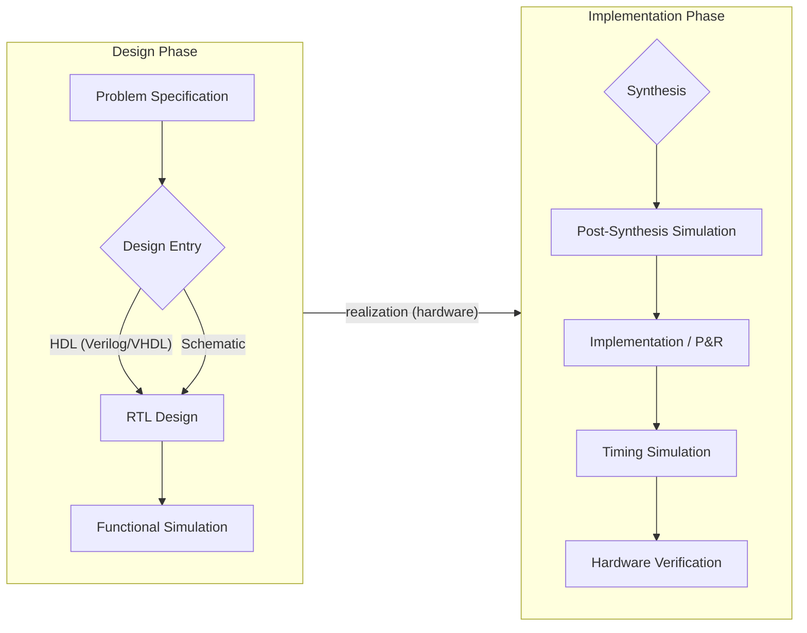

# Lecture 1: Digital System

{{ $slidev.configs.subject }}

{{ $slidev.configs.author }}

---
layout: two-cols-header
---

## Why Study Digital Systems?

Digital circuits are the **brain** of the modern world. As a future electrical engineer, you will design, build, and understand the systems that power our lives.

:: left ::

*   **Smart Devices:** Phones, watches, and home assistants.
*   **Computing:** Laptops, servers, and supercomputers.
*   **Communication:** 5G networks, Wi-Fi, and the Internet.
*   **Automotive:** Engine control, safety systems (ABS, airbags), and infotainment.
*   **Aerospace & Defense:** Avionics, guidance systems, and modern radar.

Understanding the fundamentals of digital logic is essential for a career in almost any field of electrical and computer engineering.

:: right ::

Figure 1-1. The principles you learn here are built into every complex electronic device.

---

## Learning Objectives

By the end of this lecture, you will be able to:

*   **Differentiate** between analog and digital signals.
*   **Explain** how information is represented using binary.
*   **Describe** the key historical inventions that led to the modern computer, from vacuum tubes to the integrated circuit.
*   **Recognize** the impact of Moore's Law on the growth of computing power.
*   **Categorize** the main types of digital logic chips (Standard, PLD/FPGA, ASIC).
*   **Appreciate** the role of digital systems in modern engineering and technology.

---
hideInToc: false
---

## Outline

<toc mode="onlySiblings" minDepth="2" columns="4"/>

---

## Digital vs. Analog Signals
* An **analog signal** is continuous, representing information with an infinite range of values over time. Think of a smooth, flowing wave.
* A **digital signal** is discrete, representing information with a finite set of values (like 0s and 1s). It moves in distinct steps.
 
 

Figure 1-2. An analog signal has continuous values, while a digital signal has discrete, step-like values.

---
layout: two-cols-header
---

## Switch and Binary Bit Representation

The most common digital signals are those that can have one of only two possible values, like `on` or `off` (`0` and `1`) => switch => a binary representation.

Figure 1-3. Switch and Binary Representation.

---

## Binary Representation

A binary `1001111` is representing the number 79:

Figure 1-4. Binary representation of 79.

---
layout: two-cols-header
---

## Analog to Digital Transformation: Tape Record to CD Audio
The shift from analog to digital technology has revolutionized how we create, store, and listen to music.

:: left ::

### Analog: Magnetic Tape (Cassette/Reel)
*   **Physical Medium:** Audio stored as magnetic patterns on a plastic tape.
*   **Signal Degradation:** Prone to hiss, wow and flutter, and demagnetization over time.
*   **Sequential Access:** Finding a specific track requires fast-forwarding or rewinding.

Figure 1-5. Cassette Tape.

::right::

### Digital: CD Audio
*   **Abstract Data:** Audio stored as binary data (pits and lands) on a polycarbonate disc.
*   **High Fidelity & Durability:** Offers clear, consistent sound quality, less susceptible to wear than tape.
*   **Random Access:** Tracks can be accessed instantly.

Figure 1-6. CD Audio Disc.

---
layout: two-cols-header
---

## Analog to Digital Transformation: Industrial Automation
The evolution from analog to digital sensors has been a cornerstone of modern automation and "smart" factories.
:: left ::

### Analog Sensor (e.g., Pressure Gauge)

*   **Continuous Signal:** Outputs a varying voltage or current (e.g., 4-20mA) that is proportional to the measured property (like pressure).
*   **Noise Susceptibility:** The signal can be degraded by electrical noise, affecting accuracy.
*   **Limited Information:** Only provides a single data point—the measurement itself.

::right::

### Digital Sensor (e.g., Smart Sensor)

*   **Discrete Data:** An internal ADC converts the measurement into a digital format. The sensor communicates this data via a digital protocol (e.g., IO-Link, I2C).
*   **Noise Immunity:** Digital communication is highly resistant to electrical noise.
*   **Rich Information:** Can provide the measurement, diagnostics, calibration data, and device identity over a single connection.

---
layout: two-cols
---

## Analog to Digital Conversion

To convert an analog signal to digital, we perform two key steps:
1.  **Sampling:** The value of the analog signal is measured at regular time intervals (the dots on the curve).
2.  **Quantization:** Each sampled value is mapped to the nearest value in a finite set of discrete levels (the steps).

:: right ::

Figure 1-7. Sampling process.

Figure 1-8. Quantization levels.

---
layout: two-cols-header
---

## Keypad Encoding

A keypad is organized as a matrix of rows and columns. When a key is pressed, it connects one row wire to one column wire.

:: left ::

*   **Scanning:** A microcontroller scans the keypad by activating one row (or column) at a time and then reading the columns (or rows) to see if any button is pressed.
*   **Encoding:** The unique row-column combination is then converted (encoded) into a binary number to identify the pressed key.
*   **Example:** For a 4x4 keypad (16 keys), a 4-bit binary code is sufficient to represent each key (e.g., key '1' could be `0000`, '2' could be `0001`, etc.).

::right::

Figure 1-9. Keypad Matrix Diagram.

---
layout: two-cols-header
---

## Ideal Switch to Real Switch

An ideal switch is a perfect, theoretical component, while real-world switches like transistors have physical limitations.

:: left ::

### Ideal Switch
*   Switches **instantaneously**.
*   **Zero** resistance when closed (ON).
*   **Infinite** resistance when open (OFF).
*   Consumes **no power**.

Figure 1-10. Ideal Switch Model.

:: right ::

### Real Switch (Transistor)
*   Has **finite** switching time (rise/fall time).
*   Small, **non-zero** resistance when ON.
*   Very high, but **not infinite**, resistance when OFF.
*   `Transistors` are the physical basis for digital logic.

Figure 1-11. Real Transistor.

---
layout: two-cols
---

## Digital Hardware

*   1930's Relays

Figure 1-12. Electrical Relay.

:: right ::
*   1940's VacuumTube – No moving part, Faster than Relays

Figure 1-13. Vacuum Tubes.

Figure 1-14. Vacuum Tubes in ENIAC.

---

## Digital Hardware

*   Logic circuits are used to build computer hardware as well as other products
*   Late 1960's and early 1970's saw a revolution in digital capability
    *   Smaller transistors
    *   Larger chip size
*   More transistors/chip gives greater functionality, but requires more complexity in the design process

---

## ENIAC - The First Electronic Computer
### ENIAC (Electrical Numerical Integrator And Calculator) 1946

Figure 1-15. ENIAC Computer (1946).

Figure 1-16. ENIAC Programming.

**Performance**
*   **5,000** additions/sec
*   **400** multiplications/sec
*   ~200,000x faster than hand calculation

**Components & Specs**
*   **17,468** vacuum tubes, **70,000** resistors, **10,000** capacitors
*   **1,500** relays, **6,000** manual switches
*   Power: **160 kW**

**Physical Size**
*   Area: **167 m²** (~1800 ft²)
*   Weight: **30 tons**
*   Dimensions: ~80 ft long, 8.5 ft high, 3 ft deep

---
layout: two-cols-header
---

## The First 'BUG'

:: left ::

* In 1947, Grace Murray Hopper was working on the Harvard University Mark II Aiken Relay Calculator (a primitive computer). 
* On the 9th of September, 1947, when the machine was experiencing problems, an investigation showed that there was a moth trapped between the points of Relay #70, in Panel F.

:: right ::

Figure 1-17. The First Computer Bug Log.

Figure 1-18. Grace Hopper's Moth.

---

## The First Transistor (1947) - A Revolution in Electronics

Figure 1-19. The First Point-Contact Transistor.

*   The first **point-contact transistor**, invented at Bell Labs.
*   It was a solid-state device that could amplify electrical signals, replacing bulky and unreliable vacuum tubes.

Figure 1-20. Bardeen, Shockley, and Brattain.

*   Inventors **John Bardeen, William Shockley, and Walter Brattain** were awarded the **Nobel Prize in Physics in 1956**.
*   This invention paved the way for the development of integrated circuits and the entire modern electronics industry.

---

## The First Integrated Circuit (IC) - 1958

Figure 1-21. Jack Kilby's first hybrid IC (1958). It was made of germanium and measured 7/16" x 1/16".

*   **Jack Kilby** (Texas Instruments) and **Robert Noyce** (Fairchild Semiconductor) independently invented the integrated circuit.

Figure 1-22. Early Monolithic Integrated Circuit.

*   Kilby built the first hybrid IC, while Noyce created the first monolithic IC, which was more practical for manufacturing.
*   This invention allowed for putting all electronic components onto a single die, dramatically increasing performance and decreasing cost.
*   Kilby was awarded the **Nobel Prize in Physics in 2000**.

---

## The First Logic IC

**1961:** TI and Fairchild introduced the first logic IC's (cost ~$50 in quantity!). This is a dual flip-flop with 4 transistors.

Figure 1-23. First Logic IC (Dual Flip-Flop).

**1963:** Densities and yields are improving. This circuit has four flip flops.

Figure 1-24. Four Flip-Flop IC.

**1967:** Fairchild markets the semi-custom chip shown below. Transistors could be easily rewired using a two-layer interconnect to create different circuits. This circuit contains ~150 logic gates.

Figure 1-25. Fairchild Semi-Custom Chip.

---
layout: two-cols
---

## Intel (1968)

*   Founded in July 1968 by semiconductor pioneers **Robert Noyce** and **Gordon Moore**, who left Fairchild Semiconductor.
*   The name is a portmanteau of **Int**egrated **El**ectronics.
*   **Andy Grove**, also from Fairchild, joined soon after and led the company's manufacturing operations, becoming a key figure in Intel's success.
*   Their initial business plan focused on the market for semiconductor memory, believing it would soon replace magnetic-core memory.

::right::

  
  
Figure 1-26. Gordon Moore (right), Robert Noyce (center), and Andy Grove (left). Noyce and Moore founded Intel, with Grove joining as the first employee. All three were instrumental in the company's growth.

---
layout: two-cols-header
---

## Milestone: The Microprocessor & the PC

The invention of the microprocessor on a single chip led to the personal computer revolution, fundamentally changing the world.

::left::

### Intel 4004 (1971)
*   The world's **first microprocessor**.
*   It proved that a complex general-purpose processor could be built on a single chip.
*   Initially designed for a calculator, it paved the way for all future CPUs.

### Intel 8088 & the IBM PC (1981)
*   This processor, a variant of the 8086, was chosen for the **original IBM PC**.
*   Its selection established the **x86 architecture** as the industry standard, a legacy that continues today.

::right::

Figure 1-27. Intel 4004.

Figure 1-28. Busicom Calculator.

Figure 1-29. The IBM PC, powered by an Intel 8088.

---
layout: two-cols-header
---

## Milestone: 32-bit, Multi-Core & Efficiency

Processor design has evolved from simply increasing clock speed to focusing on architectural improvements, parallelism, and power efficiency.

::left::

### The 32-bit Leap: Intel 80386 (1985)
*   The first 32-bit x86 processor, a massive jump in capability.
*   It enabled **modern multitasking operating systems** like Microsoft Windows and Linux.

### The Multi-Core: Core 2 Duo (2006)
*   Instead of just chasing higher clock speeds, which created heat and power issues, Intel shifted focus.
*   The **Core architecture** placed multiple processors ("cores") on a single chip, dramatically increasing performance through parallelism.

::right::

### The Modern Era: Core i-Series
*   Integrates more functions (graphics, memory controller) onto the CPU.
*   Focus continues on adding more cores, increasing power efficiency, and adding specialized instructions for tasks like AI and media processing.

Figure 1-30. The 80386 die.

Figure 1-31. A Core 2 Duo.

---

## Intel Summary

| Processor   | Year | Feature Size (µm) | Transistors | Frequency (MHz) | Word Size | Package         |
|-------------|------|-------------------|-------------|-----------------|-----------|-----------------|
| 4004        | 1971 | 10                | 2.3k        | 0.75            | 4         | 16-pin DIP      |
| 8008        | 1972 | 10                | 3.5k        | 0.5-0.8         | 8         | 18-pin DIP      |
| 8080        | 1974 | 6                 | 6k          | 2               | 8         | 40-pin DIP      |
| 8086        | 1978 | 3                 | 29k         | 5-10            | 16        | 40-pin DIP      |
| 80286       | 1982 | 1.5               | 134k        | 6-12            | 16        | 68-pin PGA      |
| 80386       | 1985 | 1.5-1.0           | 275k        | 16-25           | 32        | 100-pin PGA     |
| 80486       | 1989 | 1-0.6             | 1.2M        | 25-100          | 32        | 168-pin PGA     |
| Pentium     | 1993 | 0.8-0.35          | 3.2-4.5M    | 60-300          | 32        | 296-pin PGA     |

---

## Intel Summary (Continue)

| Processor   | Year | Feature Size (µm) | Transistors | Frequency (MHz) | Word Size | Package         |
|-------------|------|-------------------|-------------|-----------------|-----------|-----------------|
| Pentium Pro | 1995 | 0.6-0.35          | 5.5M        | 166-200         | 32        | 387-pin MCM PGA |
| Pentium II  | 1997 | 0.35-0.25         | 7.5M        | 233-450         | 32        | 242-pin SECC    |
| Pentium III | 1999 | 0.25-0.18         | 9.5-28M     | 450-1000        | 32        | 330-pin SECC2   |
| Pentium 4   | 2001 | 0.18-0.13         | 42-55M      | 1400-3200       | 32        | 478-pin PGA     |
| Core 2 Duo  | 2006 | 0.065             | 291M        | 1800-3330       | 64        | 775-pin LGA     |
| Core i7     | 2008 | 0.045             | 731M        | 2660-3330       | 64        | 1366-pin LGA    |
| Core i7 (SB)| 2011 | 0.032             | 995M        | 3400-3800       | 64        | 1155-pin LGA    |
| Core i7 (SK)| 2015 | 0.014             | 1.75B       | 4000-4200       | 64        | 1151-pin LGA    |

---
layout: two-cols-header
---

## Moore's Law

*   **Gordon Moore**: co-founder of Intel.
    *   Predicted that number of transistors per chip would grow exponentially (double every 18 months).
    *   Exponential improvement in technology is a natural trend: steam engines, dynamos, automobiles.
*   Today, the price of a transistor is less than a grain of rice.

Figure 1-32. Moore's Law Graph.

---
layout: two-cols-header
---

## Types of Logic Chips: Standard Chips (74xx)

::left::

*   Contain a small, fixed amount of circuitry (typically < 100 transistors).
*   Perform simple, fundamental logic functions (e.g., AND, OR, NOT, Flip-Flops).
*   The **74xx series** is a famous family of standard logic ICs.
*   Used as "glue logic" to connect larger chips or for simple tasks.
*   Not programmable; their function is determined during manufacturing.

::right::

Figure 1-33. 74HC00 NAND Gate IC.

Figure 1-34. 7400 Internal Diagram.

Figure 1-35. A 74xx 24H Digital Quartz Clock.

---
layout: two-cols-header
---

## Types of Logic Chips: Programmable Logic (PLD/FPGA)

::left::

*   A collection of logic gates with programmable interconnections.
*   The chip's function is configured by the designer/user **after** manufacturing.
*   Designed using CAD tools and Hardware Description Languages (HDLs) like VHDL or Verilog.
*   **PLD (Programmable Logic Device):** Simpler, for smaller tasks.
*   **FPGA (Field-Programmable Gate Array):** Much larger and more complex, containing thousands to millions of logic cells. Ideal for prototyping ASICs and complex systems.

::right::

Figure 1-36. Die of an FPGA showing logic cells and interconnection wires.

Figure 1-37. VHDL and Verilog are the most popular HDLs.

---
layout: two-cols-header
---

## Types of Logic Chips: Custom Chips (ASIC)

::left::

*   **ASIC (Application-Specific Integrated Circuit)** is a chip customized for a particular use.
*   Optimized for a specific task, offering the best performance, smallest size, and lowest power consumption.
*   The design is permanent and cannot be changed after manufacturing.
*   Very high initial cost (Non-Recurring Engineering) for design and production masks.
*   Economically viable only for very high-volume products (e.g., smartphones, game consoles).

::right::

Figure 1-38. An example of a complex ASIC: NVIDIA's Turing GPU.

---
layout: two-cols-header
---

## The Development Process

A typical digital circuit design flow involves several key stages, from initial concept to final implementation.

:: left ::

* **Design Phase**

This phase focuses on defining what the circuit should do and describing its behavior at a high level of abstraction, typically using an HDL.
* **Implementation Phase**

This phase transforms the abstract design into a physical, manufacturable layout, ensuring it meets performance, area, and power targets.

:: right ::

Figure 1-39. A Development Flow of Digtial Circuit.

---
layout: default
---

## Where Do We Go From Here?

This lecture was a historical overview. In the coming lectures, we will dive into the fundamental building blocks of digital systems:

*   **Number Systems:** Beyond binary, we'll explore other systems like hexadecimal used in computing.
*   **Boolean Algebra:** The mathematical foundation for digital logic.
*   **Logic Gates:** The basic electronic circuits (AND, OR, NOT) that perform Boolean operations.
*   **Combinational Logic Circuits:** Designing circuits without memory, like adders and decoders.
*   **Sequential Logic Circuits:** Designing circuits with memory, like counters and state machines.
*   **Dedicated Microprocessors:** Understanding the architecture, datapath, and control unit of specialized processors.

These concepts are the foundation upon which all modern digital electronics are built.

---
layout: two-cols-header
---

## Lecture 1 Summary

This lecture provides an introduction to digital systems, tracing their evolution from basic concepts to modern processors.
:: left ::

*   **Fundamentals:** Distinguishes between **analog** (continuous) and **digital** (discrete) signals, represented by binary values. Covers Analog-to-Digital conversion (**sampling** and **quantization**).

*   **Early Hardware:** Traces history from **relays** and **vacuum tubes** to **ENIAC** (1946), the first electronic computer.

*   **Key Inventions:** Highlights the **transistor** (1947) and the **Integrated Circuit (IC)** (1958) as revolutionary milestones.

:: right ::

*   **Microprocessors:** Details the evolution of Intel processors from the **4004 (1971)** to modern multi-core CPUs, establishing the x86 architecture.

*   **Moore's Law:** Explains the prediction of exponential growth in transistor density on chips.

*   **Types of Logic Chips:** Categorizes chips into **Standard (74xx)**, **Programmable (FPGAs)**, and **Custom (ASICs)**.

*   **Design Process:** Outlines the modern digital design flow, from specification and HDL to physical implementation.