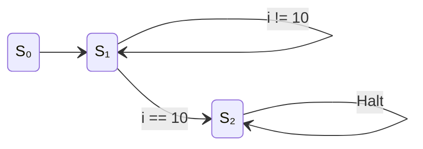
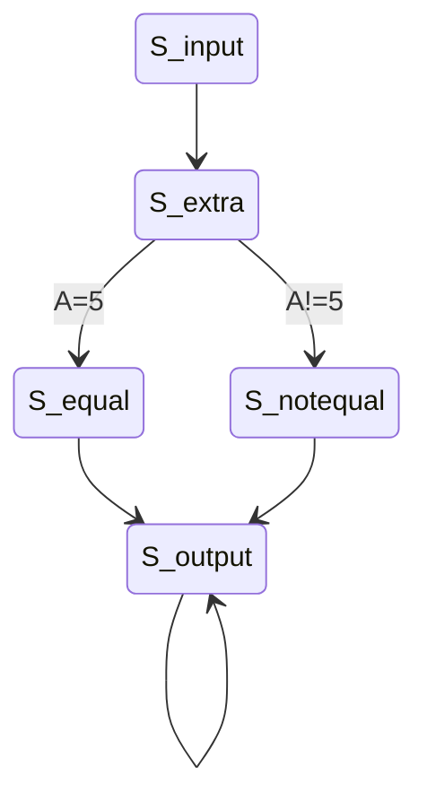
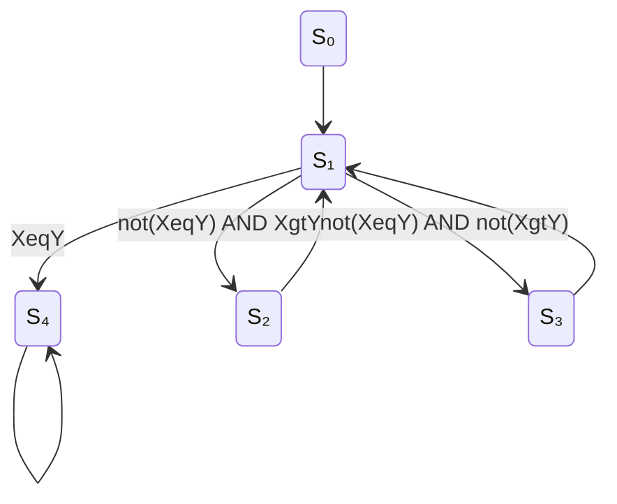

# Lecture 10: Control Unit Design
{{ $slidev.configs.subject }}
<div class="abs-br m-6 text-sm">
010113025 Digital Circuits and Logic Design
</div>

{{ $slidev.configs.author }}
---

## Outline

*   Recap: Datapath & Control Unit
*   Control Unit as a Finite State Machine (FSM)
*   Design Example 1: Counter Control Unit
    *   FSM State Diagram
    *   State Table & Synthesis
    *   Complete Microprocessor
*   Design Example 2: `if-then-else` Control Unit
    *   FSM State Diagram
    *   State Table & Synthesis
*   Design Example 3: GCD Control Unit
    *   FSM State Diagram
    *   State Table & Synthesis
*   Design Methodologies: FSM+D vs. FSMD

---

## Recap: Datapath and Control Unit

A microprocessor is partitioned into two main parts that work together.

*   **Datapath:**
    *   Performs data processing operations. Contains ALUs, registers, MUXes, etc.

*   **Control Unit:**
    *   A Finite State Machine that determines the sequence of datapath operations.
    *   Generates **control signals** to tell the datapath what to do.
    *   Receives **status signals** from the datapath to make decisions.


Our goal now is to design the **Control Unit** FSM.

---

## Design Example 1: Counter Control Unit

Let's design the control unit for the "Count from 1 to 10" algorithm.

<div class="grid grid-cols-2 gap-8">

<div>

**Algorithm:**
```
i = 0
WHILE (i != 10) {
  i = i + 1
}
```

**Datapath:**


**Status Signal:** `(i=10)`
**Control Signals:** `Clear`, `Count`

</div>

<div>

**Control Unit FSM (State Diagram):**

*   **S₀ (Init):** Clear the counter (`i=0`).
*   **S₁ (Count):** Increment the counter (`i=i+1`).
*   **S₂ (Done):** Loop is finished.



</div>
</div>

---

## Counter Control Unit: State & Output Tables

We can now create the tables from the state diagram.
**State Assignment:** `S₀=00`, `S₁=01`, `S₂=10`, `S₃(Halt)=11`.
**Input:** `(i=10)` status signal.

<div class="grid grid-cols-2 gap-8">

<div>

### Next State Table

| Current State | Input `(i=10)` | Next State |
|:-------------:|:--------------:|:----------:|
| `Q₁Q₀`        |                | `D₁D₀`     |
| 00 (S₀)       | X              | 01 (S₁)    |
| 01 (S₁)       | 0              | 01 (S₁)    |
| 01 (S₁)       | 1              | 10 (S₂)    |
| 10 (S₂)       | X              | 11 (S₃)    |
| 11 (S₃)       | X              | 11 (S₃)    |

</div>

<div>

### Output Table (Moore Model)

| Current State | `Clear` | `Count` |
|:-------------:|:-------:|:-------:|
| 00 (S₀)       | 1       | 0       |
| 01 (S₁)       | 0       | 1       |
| 10 (S₂)       | 0       | 0       |
| 11 (S₃)       | 0       | 0       |

</div>
</div>

From these tables, we can derive the logic equations for the FSM.

---

## Counter Control Unit: Complete Microprocessor

By combining the datapath and the synthesized control unit, we get the complete dedicated microprocessor. The control unit's logic generates the `Clear` and `Count` signals, while the `(i=10)` status signal from the datapath feeds back into the control unit's next-state logic.


---

## Design Example 2: `if-then-else` Control Unit

**Algorithm:**
```
INPUT A
IF (A = 5) THEN
  B = 8
ELSE
  B = 13
END IF
OUTPUT B
```

<div class="grid grid-cols-2 gap-8">

<div>

**Datapath:**


**Status Signal:** `(A=5)`
**Control Signals:** `ALoad`, `BLoad`, `Muxsel`, `Out`

</div>

<div>

**Control Unit FSM (State Diagram):**

*   **S_input:** Load register A.
*   **S_extra:** A wait state to allow register A to settle before checking its value.
*   **S_equal:** Load B with 8.
*   **S_notequal:** Load B with 13.
*   **S_output:** Output the value from B.



</div>
</div>

---

## `if-then-else` Control Unit: Synthesis

From the state diagram, we derive the state and output tables to synthesize the logic.

**State Assignment:** `S_input=000`, `S_extra=001`, `S_notequal=010`, `S_equal=011`, `S_output=100`

<div class="grid grid-cols-2 gap-8">

<div>

### Next State Table (Partial)

| PS | Input `(A=5)` | NS |
|:--:|:-------------:|:--:|
| 000 | X | 001 |
| 001 | 0 | 010 |
| 001 | 1 | 011 |
| 010 | X | 100 |
| 011 | X | 100 |
| 100 | X | 100 |

</div>

<div>

### Output Table (Moore Model)

| State | `ALoad` | `Muxsel` | `BLoad` | `Out` |
|:-----:|:-------:|:--------:|:-------:|:-----:|
| 000 | 1 | X | 0 | 0 |
| 010 | 0 | 0 | 1 | 0 |
| 011 | 0 | 1 | 1 | 0 |
| 100 | 0 | X | 0 | 1 |

</div>
</div>

**Synthesized Logic (from PDF):**
*   `ALoad = Q₂'Q₁'Q₀'`
*   `Muxsel = Q₂'Q₁'Q₀`
*   `BLoad = Q₂'Q₁`
*   `Out = Q₂Q₁'Q₀'`

---

## Design Example 3: GCD Control Unit

**Problem:** Design a control unit to find the Greatest Common Divisor (GCD) of two numbers, X and Y.

<div class="grid grid-cols-2 gap-8">

<div>

**Algorithm:**
```
WHILE (X != Y) {
  IF (X > Y) THEN
    X = X - Y
  ELSE
    Y = Y - X
}
```

**Datapath:**


**Status Signals:** `XeqY`, `XgtY`

</div>

<div>

**Control Unit FSM (State Diagram):**

*   **S₀ (Init):** Load X and Y.
*   **S₁ (Check):** Compare X and Y.
*   **S₂ (X=X-Y):** Perform subtraction.
*   **S₃ (Y=Y-X):** Perform subtraction.
*   **S₄ (Done):** Output the result.



</div>
</div>

---

## FSM+D vs. FSMD

There are two main methodologies for designing microprocessor systems in an HDL.

### FSM+D (FSM plus Datapath)
*   The FSM (Control Unit) and the Datapath are designed as **separate, manually constructed units**.
*   They are then connected together in a top-level module.
*   **Advantage:** You have full, explicit control over the datapath structure. This is useful for highly optimized or unusual datapaths. This is the method we have been following.

### FSMD (FSM with Datapath)
*   The entire design is described as a **single behavioral FSM** in an HDL.
*   Datapath operations (like `A <= B + C;`) are embedded directly within the FSM states.
*   The synthesis tool automatically infers and generates the necessary datapath components (registers, adders, MUXes) and connects them to the control unit.
*   **Advantage:** Faster and simpler design process for standard operations. This is the most common modern approach.