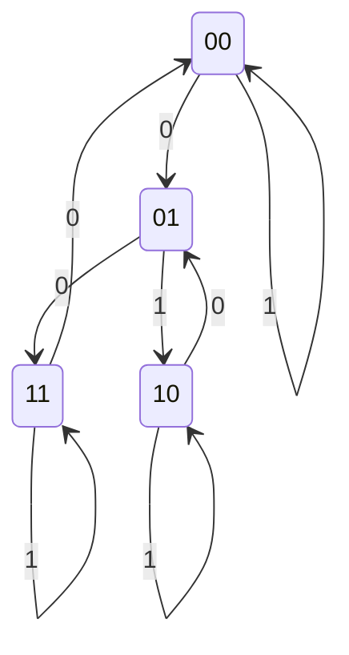
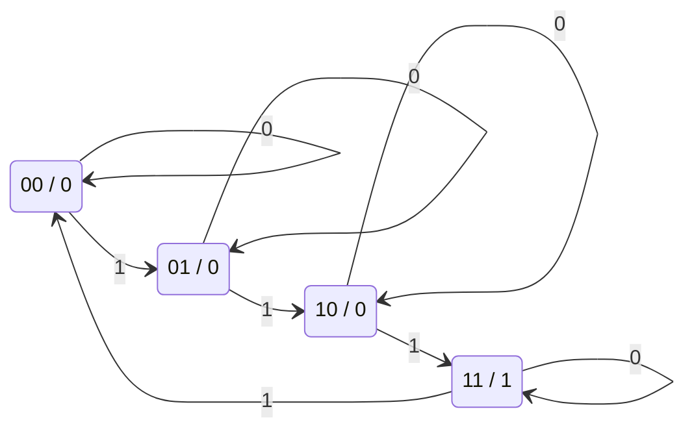
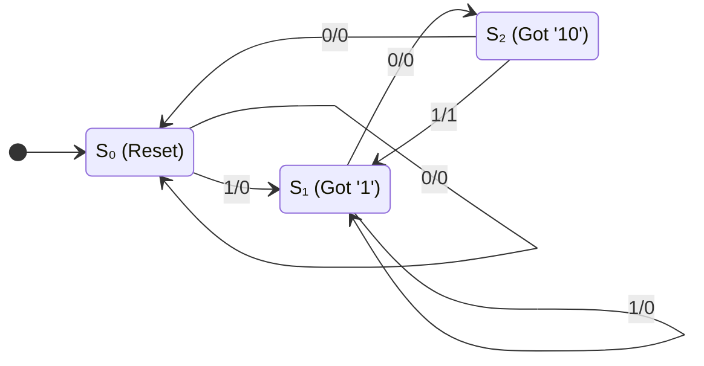

# Lecture 6: Latches, Flip-flops, & Synchronous Sequential Logic
{{ $slidev.configs.subject }}
<div class="abs-br m-6 text-sm">
010113025 Digital Circuits and Logic Design
</div>

{{ $slidev.configs.author }}
---

## Outline

*   Sequential Circuits
*   Latches (SR, D)
*   Flip-Flops (D, JK, T)
    *   Level vs. Edge Triggering
    *   Master-Slave Flip-Flops
*   Characteristic Tables & Equations
*   Analysis of Clocked Sequential Circuits
    *   State Equations, State Tables, State Diagrams
*   Mealy and Moore Models
*   State Reduction & Assignment
*   Design of Sequential Circuits

---

## Sequential Circuits

Unlike combinational circuits, **sequential circuits** have memory.

*   **Combinational Logic**: Performs logic operations to determine outputs and the next state.
*   **Memory Elements**: Store the current state (Present State) and are updated by the clock.
*   **Feedback Loop**: The **Present State** is fed back to the combinational logic to influence future actions.
*   **Outputs**: Determined by the **Present State** and/or **Inputs** (`Mealy` or `Moore` models).


<p class="text-sm text-center">Figure 6-1. Sequential Circuit Block Diagram.</p>

---

## Synchronous vs. Asynchronous

*   **Synchronous Sequential Circuits:**
    *   State transitions happen at discrete moments in time, controlled by a clock signal.
    *   A master clock generator provides a periodic train of clock pulses.
    *   These are the most common type, as they are easier to design and avoid instability issues.
    *   The memory elements are **flip-flops**.

*   **Asynchronous Sequential Circuits:**
    *   State transitions can happen at any time, triggered by changes in the input signals.
    *   The memory elements are often simple **latches**.

---
layout: two-cols-header
---

## SR Latch

A **latch** is a basic memory element that can store one bit of information. It is a type of **bistable multivibrator**.

### Basic SR Latch (NOR Gates)

:: left ::

*   Built from two cross-coupled NOR gates.
*   $S$ stands for Set, $R$ stands for Reset.
*   $(S,R) = (0,0)$: **No change**. The latch holds its current state.
*   $(S,R) = (1,0)$: **Set**. Forces output $Q$ to 1.
*   $(S,R) = (0,1)$: **Reset**. Forces output $Q$ to 0.
*   $(S,R) = (1,1)$: **Invalid/Indeterminate**. Both $Q$ and $Q'$ become 0, which violates the $Q' = not(Q)$ rule. This state should be avoided.

:: right ::


<p class="text-sm text-center">Figure 6-2. SR Latch with NOR Gates.</p>

<div class="mt-4 flex justify-center text-sm">

$$
\begin{array}{|cc|cc|l|}
\hline
S & R & Q_{(t+1)} & Q'_{(t+1)} & \text{State} \\
\hline
0 & 0 & Q & Q' & \text{No Change} \\
0 & 1 & 0 & 1 & \text{Reset} \\
1 & 0 & 1 & 0 & \text{Set} \\
1 & 1 & 0 & 0 & \text{Invalid} \\
\hline
\end{array}
$$

</div>

---
layout: two-cols-header
---

## $\bar{S}\bar{R}$ Latch (with NAND gates)

The **$\bar{S}\bar{R}$ Latch** uses NAND gates instead of NOR gates. The basic behavior is similar, but the inputs are **active low**.
:: left ::

### Basic $\bar{S}\bar{R}$ Latch (NAND Gates)
*   Built from two cross-coupled NAND gates.
*   Inputs are labeled $\overline{S}$ and $\overline{R}$ (active low).
*   $(\overline{S},\overline{R}) = (1,1)$: **No Change**. Holds state.
*   $(\overline{S},\overline{R}) = (0,1)$: **Set**. Forces $Q=1$.
*   $(\overline{S},\overline{R}) = (1,0)$: **Reset**. Forces $Q=0$.
*   $(\overline{S},\overline{R}) = (0,0)$: **Invalid**. Both $Q$ and $Q'$ go to 1.

:: right ::


<p class="text-sm text-center">Figure 6-3. S'R' Latch with NAND Gates.</p>

<div class="mt-4 flex justify-center text-sm">

$$
\begin{array}{|cc|cc|l|}
\hline
\overline{S} & \overline{R} & Q_{(t+1)} & Q'_{(t+1)} & \text{State} \\
\hline
0 & 0 & 1 & 1 & \text{Invalid} \\
0 & 1 & 1 & 0 & \text{Set} \\
1 & 0 & 0 & 1 & \text{Reset} \\
1 & 1 & Q & Q' & \text{No Change} \\
\hline
\end{array}
$$

</div>
---

## SR Latch with Control Input (Gated SR Latch)

An SR latch can be modified to only change state when a control input `C` (or Enable) is active.

*   When `C = 0`, the inputs S and R have no effect. The latch holds its state.
*   When `C = 1`, the latch is enabled and behaves like a normal SR latch.

<div class="grid grid-cols-2 gap-8 items-center">
<div>

<p class="text-sm text-center">Figure 6-3. Gated SR Latch Logic Diagram.</p>
</div>
<div>
$$
\begin{array}{|c|cc|l|}
\hline
C & S & R & Q_{(t+1)} \\
\hline
0 & X & X & \text{No change} \\
1 & 0 & 0 & \text{No change} \\
1 & 0 & 1 & Q = 0 \text{ (Reset)} \\
1 & 1 & 0 & Q = 1 \text{ (Set)} \\
1 & 1 & 1 & \text{Indeterminate} \\
\hline
\end{array}
$$
</div>
</div>

---

## D Latch (Gated D Latch)

The D latch (Data latch) eliminates the indeterminate state of the SR latch.

*   It has one data input $D$ and a control input $C$.
*   An inverter ensures that S and R are never equal to 1 at the same time.
*   When $C = 1$, the output $Q$ follows the input $D$. The latch is "transparent".
*   When $C = 0$, the latch is closed and holds the last value of $D$.
* $Q_{(t+1)} = D$ (when C=1)

<div class="grid grid-cols-2 gap-8 items-center">

<div>

<p class="text-sm text-center">Figure 6-4. D Latch Logic Diagram.</p>
</div>
$$
\begin{array}{|c|c|l|}
\hline
C & D & Q_{(t+1)} \\
\hline
0 & X & \text{No change} \\
1 & 0 & Q = 0 \text{ (Reset)} \\
1 & 1 & Q = 1 \text{ (Set)} \\
\hline
\end{array}
$$

</div>

---

## Latch Symbols

Logic symbols for the various latches discussed:


<p class="text-sm text-center">Figure 6-5. Logic Symbols for SR, S'R', and D Latches.</p>


---

### VHDL Implementation (D Latch)

```vhdl
library ieee;
use ieee.std_logic_1164.all;

entity d_latch is
    port ( D, C : in  std_logic;
           Q    : out std_logic );
end d_latch;

architecture behavioral of d_latch is
begin
    process(C, D)
    begin
        if C = '1' then
            Q <= D;
        end if;
    end process;
end behavioral;
```

---
layout: two-cols-header
---


## Flip-Flops: Edge-Triggered vs. Level-Triggered

:: left ::

Latches are **level-triggered**: their output can change anytime the control input `C` is high. This can cause instability in synchronous circuits with feedback.

**Flip-flops** are **edge-triggered**: they only change state at a specific point on the clock signal.

*   **Positive-edge triggered:** Changes state on the rising edge of the clock (0 &rarr; 1).
*   **Negative-edge triggered:** Changes state on the falling edge of the clock (1 &rarr; 0).

This edge-triggered behavior prevents the multiple-transition problem and ensures all state changes in a system happen simultaneously.

:: right ::


<p class="text-sm text-center">Figure 6-6. Trigger Signals (Level, Positive Edge, Negative Edge).</p>

---
layout: two-cols-header
---

## Edge-Triggered D Flip-Flop

<div class="text-base">

The most common and efficient flip-flop. It captures the value of the D input at the active clock edge and stores it in Q.

</div>

:: left ::

### Master-Slave D Flip-Flop

<div class="text-base">

One way to build an edge-triggered flip-flop is with a master-slave configuration.

*   Consists of two latches: a **master** (e.g., positive-level triggered) and a **slave** (e.g., negative-level triggered).
*   **When CLK=1:** The master latch is open and follows the D input. The slave latch is closed, holding the previous value.
*   **When CLK falls to 0:** The master latch closes, capturing the value of D. The slave latch opens, receiving the value from the master and outputting it on Q.

The output Q only changes on the **falling edge** of the clock.

</div>

:: right ::


<p class="text-sm text-center">Figure 6-7. Master-Slave D Flip-Flop.</p>


<p class="text-sm text-center">Figure 6-8. D Flip-Flop Negative Edge.</p>

---

### VHDL Implementation (D Flip-Flop)

```vhdl
library ieee;
use ieee.std_logic_1164.all;

entity d_ff is
    port ( D, CLK : in  std_logic;
           Q     : out std_logic );
end d_ff;

architecture behavioral of d_ff is
begin
    process(CLK)
    begin
        if rising_edge(CLK) then
            Q <= D;
        end if;
    end process;
end behavioral;
```

---
layout: two-cols-header
---

## JK Flip-Flop
JK flip-flop can be constructed from a D flip-flop and external gates.

:: left ::

*   Inputs $J$ (like Set) and $K$ (like Reset).
*   $J=0, K=0$: Holds state.
*   $J=0, K=1$: Resets (Q=0).
*   $J=1, K=0$: Sets (Q=1).
*   $J=1, K=1$: **Toggles** the state (Q becomes Q'). This is the key advantage over an SR flip-flop.
*   **Characteristic Equation:** 
    * $Q(t+1) = JQ' + K'Q$

:: right ::


<p class="text-sm text-center">Figure 6-9. Logic Diagram of a JK Flip-Flop from a D Flip-Flop.</p>


<p class="text-sm text-center">Figure 6-10. JK Flip-Flop Symbol.</p>

---
layout: two-cols-header
---

## T Flip-Flop (Toggle)

:: left ::

*   Single input `T`.
*   `T=0`: Holds state.
*   `T=1`: Toggles the state.
*   Useful for building counters.
*   **Characteristic Equation:**  
    * $Q(t+1) = T \oplus Q$


<p class="text-sm text-center">Figure 6-11. T Flip-Flop Symbol.</p>


:: right ::


<p class="text-sm text-center">Figure 6-12. T Flip-Flop from JK Flip-Flop.</p>


<p class="text-sm text-center">Figure 6-13. T Flip-Flop from D Flip-Flop.</p>
  
---

## Flip-Flop Characteristic Tables

These define the next state $Q_{(t+1)}$ based on the current inputs and current state $Q_{(t)}$.

<div class="grid grid-cols-4 gap-4 text-center">

<div>

### SR Flip-Flop
$Q_{(t+1)} = S + R'Q$

$$
\begin{array}{cc|c}
S & R & Q_{(t+1)} \\
\hline
0 & 0 & Q_{(t)} \\
0 & 1 & 0 \\
1 & 0 & 1 \\
1 & 1 & ? \\
\end{array}
$$

</div>

<div>

### D Flip-Flop
$Q_{(t+1)} = D$

$$
\begin{array}{c|c}
D & Q_{(t+1)} \\
\hline
0 & 0 \\
1 & 1 \\
\end{array}
$$

</div>
<div>

### T Flip-Flop
$Q_{(t+1)} = T \oplus Q$

$$
\begin{array}{c|c}
T & Q_{(t+1)} \\
\hline
0 & Q_{(t)} \\
1 & Q_{(t)}' \\
\end{array}
$$

</div>

<div>

### JK Flip-Flop
$Q_{(t+1)} = JQ' + K'Q$

$$
\begin{array}{cc|c}
J & K & Q_{(t+1)} \\
\hline
0 & 0 & Q_{(t)} \\
0 & 1 & 0 \\
1 & 0 & 1 \\
1 & 1 & Q_{(t)}' \\
\end{array}
$$

</div>
</div>

---

## Analysis of Clocked Sequential Circuits

Analysis is the process of determining the function of a sequential circuit from its logic diagram. The goal is to derive a **state table** or **state diagram**.

**Procedure:**
1.  Determine the **flip-flop input equations** (also called excitation equations) and the **output equations** from the combinational logic part of the circuit.
2.  Use these equations and the flip-flop characteristic equations to derive the **next state equations**.
    *   $A_{(t+1)} = D_A$ for a D flip-flop.
    *   $A_{(t+1)} = J_A A' + K_A A$ for a JK flip-flop.
3.  Construct a **state table** that lists the next state and output for every combination of present state and input.
4.  (Optional) Draw a **state diagram**, which is a graphical representation of the state table.

---


## Analysis Example

Let's analyze the following circuit with two D flip-flops ($A$ and $B$), one input ($x$), and one output ($y$).

<div class="grid grid-cols-3 gap-4">

<div class="col-span-2">


<p class="text-sm text-center">Figure 6-14. Sequential Circuit for Analysis.</p>

</div>

<div>

1.  **Flip-Flop Input & Circuit Output Equations:**
    *   $D_A = Ax + Bx$
    *   $D_B = A'x$
    *   $y = A + Bx'$

2.  **Next State Equations (since they are D flip-flops):**
    *   $A_{(t+1)} = Ax + Bx$
    *   $B_{(t+1)} = A'x$

</div>

</div>

---

## Analysis Example: State Table

3.  **Construct the State Table:** We fill in the table using the next state and output equations for all combinations of present state (A, B) and input (x).

| Present State | Input | Next State | Output |
|:-------------:|:-----:|:----------:|:------:|
| **A B**       | **x** | **A B**    | **y**  |
| 0 0           | 0     | 0 0        | 0      |
| 0 0           | 1     | 0 1        | 0      |
| 0 1           | 0     | 0 0        | 1      |
| 0 1           | 1     | 1 1        | 0      |
| 1 0           | 0     | 0 0        | 1      |
| 1 0           | 1     | 1 0        | 0      |
| 1 1           | 0     | 0 0        | 1      |
| 1 1           | 1     | 1 0        | 0      |

---

## Analysis Example: State Diagram

4.  **Draw the State Diagram:**
    *   Each circle represents a state (the value of the flip-flops, AB).
    *   Each arrow represents a transition between states.
    *   The label on the arrow is in the format `input / output`.


This completes the analysis. The state diagram fully describes the circuit's behavior over time.

---
layout: two-cols-header
---

## Analysis with JK Flip-Flops

The procedure is similar, but we use the JK flip-flop's characteristic equation: `Q(t+1) = JQ' + K'Q`.

::left::


1.  **Input Equations:**
    *   `Jₐ = B`
    *   `Kₐ = Bx'`
    *   `Jₑ = x'`
    *   `Kₑ = A'x + Ax' = A ⊕ x`

2.  **Next State Equations:**
    *   `A(t+1) = JₐA' + Kₐ'A = BA' + (Bx')'A`
    *   `B(t+1) = JₑB' + Kₑ'B = x'B' + (A ⊕ x)'B`

::right::

3.  **State Table:**

| Present State | Input | Next State |
|:-------------:|:-----:|:----------:|
| **A B**       | **x** | **A B**    |
| 0 0           | 0     | 0 1        |
| 0 0           | 1     | 0 0        |
| 0 1           | 0     | 1 1        |
| 0 1           | 1     | 1 0        |
| 1 0           | 0     | 0 1        |
| 1 0           | 1     | 1 0        |
| 1 1           | 0     | 0 0        |
| 1 1           | 1     | 1 1        |

4.  **State Diagram:**



---
layout: two-cols-header
---

## Analysis with T Flip-Flops

Here, we use the T flip-flop's characteristic equation: `Q(t+1) = T ⊕ Q`.

::left::


1.  **Input & Output Equations:**
    *   `Tₐ = Bx`
    *   `Tₑ = x`
    *   `y = AB`

2.  **Next State Equations:**
    *   `A(t+1) = Tₐ ⊕ A = (Bx) ⊕ A`
    *   `B(t+1) = Tₑ ⊕ B = x ⊕ B`

::right::

3.  **State Table:**

| Present State | Input | Next State | Output |
|:-------------:|:-----:|:----------:|:------:|
| **A B**       | **x** | **A B**    | **y**  |
| 0 0           | 0     | 0 0        | 0      |
| 0 0           | 1     | 0 1        | 0      |
| 0 1           | 0     | 0 1        | 0      |
| 0 1           | 1     | 1 0        | 0      |
| 1 0           | 0     | 1 0        | 0      |
| 1 0           | 1     | 1 1        | 0      |
| 1 1           | 0     | 1 1        | 1      |
| 1 1           | 1     | 0 0        | 1      |

4.  **State Diagram (Moore Model):**



---

## Mealy and Moore Models

Sequential circuits are classified into two models based on how their outputs are generated.

### Mealy Model
*   The outputs are a function of both the **present state AND the current inputs**.
*   The output value is written on the transition arrow in the state diagram (`input / output`).
*   Outputs can change immediately if the input changes, even between clock edges. This can sometimes lead to momentary false outputs.

### Moore Model
*   The outputs are a function of the **present state ONLY**.
*   The output value is written inside the state circle (`state / output`).
*   Outputs are synchronous with the clock; they only change when the state changes.


---

## Design of Sequential Circuits

Design is the reverse of analysis. We start with a specification and end with a logic diagram.

**Procedure:**
1.  Create a **state diagram** from the problem description.
2.  Perform **state reduction** to eliminate redundant states.
3.  Perform **state assignment** to assign unique binary codes to each state.
4.  Create the binary-coded **state table**.
5.  Choose the **type of flip-flop** to use (D, JK, T).
6.  Derive the simplified **flip-flop input equations** and **output equations** (using K-maps).
7.  Draw the final **logic diagram**.

---

## Design Example: Sequence Detector

1.  **Problem & State Diagram:** Design a circuit that outputs `y=1` when it detects the sequence of inputs `101` on input `x`.

    **State Diagram:** We need states to remember "have seen nothing", "have seen a 1", "have seen 10".
    *   `S₀`: Initial state (reset).
    *   `S₁`: Last input was `1`.
    *   `S₂`: Last two inputs were `10`.
    *   If in `S₂` and we get a `1`, the sequence is complete, so output `1`.



---

## Synthesis with D Flip-Flops

2.  **State Reduction:** The diagram has no redundant states. (We will cover this in more detail later).
3.  **State Assignment:** `S₀=00`, `S₁=01`, `S₂=10`. (We need 2 flip-flops, A and B).
4.  **Binary State Table:**

| Present State | Input | Next State | Output |
|:-------------:|:-----:|:----------:|:------:|
| **A B**       | **x** | **A B**    | **y**  |
| 0 0           | 0     | 0 0        | 0      |
| 0 0           | 1     | 0 1        | 0      |
| 0 1           | 0     | 1 0        | 0      |
| 0 1           | 1     | 0 1        | 0      |
| 1 0           | 0     | 0 0        | 0      |
| 1 0           | 1     | 0 1        | 1      |

5.  **Derive Equations (from K-maps):** For D flip-flops, the input equation is simply the next state value.
    *   `Dₐ = A(t+1) = Bx'`
    *   `Dₑ = B(t+1) = x`
    *   `y = Ax`

6.  **Draw the Logic Diagram:**


### VHDL Implementation

```vhdl
library ieee;
use ieee.std_logic_1164.all;

entity sequence_detector is
    port ( clk, reset : in  std_logic;
           x         : in  std_logic;
           y         : out std_logic );
end sequence_detector;

architecture fsm of sequence_detector is
    type state_type is (S0, S1, S2);
    signal current_state, next_state : state_type;
begin
    -- State Register (Sequential)
    process(clk, reset)
    begin
        if reset = '1' then
            current_state <= S0;
        elsif rising_edge(clk) then
            current_state <= next_state;
        end if;
    end process;

    -- Next State & Output Logic (Combinational)
    process(current_state, x)
    begin
        y <= '0'; -- Default output
        case current_state is
            when S0 => if x = '1' then next_state <= S1; else next_state <= S0; end if;
            when S1 => if x = '0' then next_state <= S2; else next_state <= S1; end if;
            when S2 => if x = '1' then y <= '1'; next_state <= S1; else next_state <= S0; end if;
        end case;
    end process;
end fsm;
```

---

## Flip-Flop Excitation Tables

For JK and T flip-flops, we need **excitation tables**. They tell us what the flip-flop inputs (J, K, or T) must be to cause a specific state transition from `Q(t)` to `Q(t+1)`.

<div class="grid grid-cols-2 gap-8">

<div>

### JK Excitation Table

| Q(t) | Q(t+1) | J | K |
|:----:|:------:|:-:|:-:|
|  0   |    0   | 0 | X |
|  0   |    1   | 1 | X |
|  1   |    0   | X | 1 |
|  1   |    1   | X | 0 |

</div>

<div>

### T Excitation Table

| Q(t) | Q(t+1) | T |
|:----:|:------:|:-:|
|  0   |    0   | 0 |
|  0   |    1   | 1 |
|  1   |    0   | 1 |
|  1   |    1   | 0 |

</div>
</div>

---

## Synthesis with JK Flip-Flops

Let's synthesize the same sequence detector using JK flip-flops.

1.  **Create the Excitation Table:** We add columns for the JK inputs and fill them in by looking at the state transitions for A and B.

| PS | Input | NS | Flip-Flop Inputs |
|:----:|:-----:|:----:|:----------------:|
| A B  |   x   | A B  | Jₐ Kₐ | Jₑ Kₑ |
| 0 0  |   0   | 0 0  | 0  X  | 0  X  |
| 0 0  |   1   | 0 1  | 0  X  | 1  X  |
| 0 1  |   0   | 1 0  | 1  X  | X  1  |
| 0 1  |   1   | 0 1  | 0  X  | X  0  |
| 1 0  |   0   | 0 0  | X  1  | 0  X  |
| 1 0  |   1   | 0 1  | X  1  | 1  X  |

2.  **Derive Equations (from K-maps):**
    *   `Jₐ = Bx'`
    *   `Kₐ = x`
    *   `Jₑ = x`
    *   `Kₑ = x'`
    *   `y = Ax` (same as before)

3.  **Draw the Logic Diagram:**


---

## Synthesis with T Flip-Flops: Binary Counter

**Problem:** Design a 3-bit binary counter. This circuit has no inputs (besides the clock) and cycles through states 000 to 111.

1.  **State Table & Excitations:**

| Present State | Next State | Flip-Flop Inputs |
|:-------------:|:----------:|:----------------:|
| A₂ A₁ A₀      | A₂ A₁ A₀   | Tₐ₂ Tₐ₁ Tₐ₀      |
| 0  0  0       | 0  0  1    | 0   0   1        |
| 0  0  1       | 0  1  0    | 0   1   1        |
| 0  1  0       | 0  1  1    | 0   0   1        |
| 0  1  1       | 1  0  0    | 1   1   1        |
| 1  0  0       | 1  0  1    | 0   0   1        |
| 1  0  1       | 1  1  0    | 0   1   1        |
| 1  1  0       | 1  1  1    | 0   0   1        |
| 1  1  1       | 0  0  0    | 1   1   1        |

2.  **Derive Equations (from K-maps):**
    *   `Tₐ₂ = A₁A₀`
    *   `Tₐ₁ = A₀`
    *   `Tₐ₀ = 1`

3.  **Draw the Logic Diagram:**

