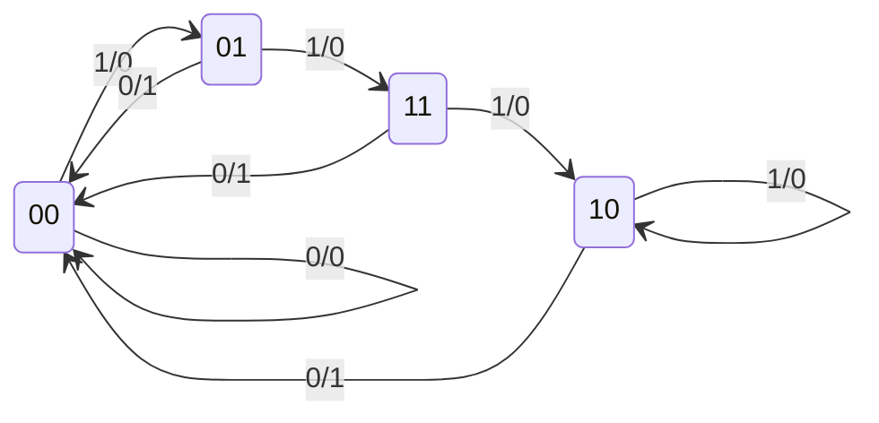
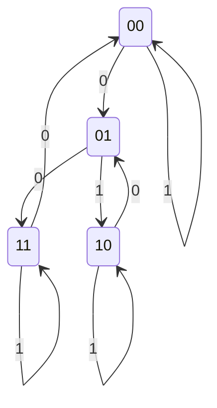
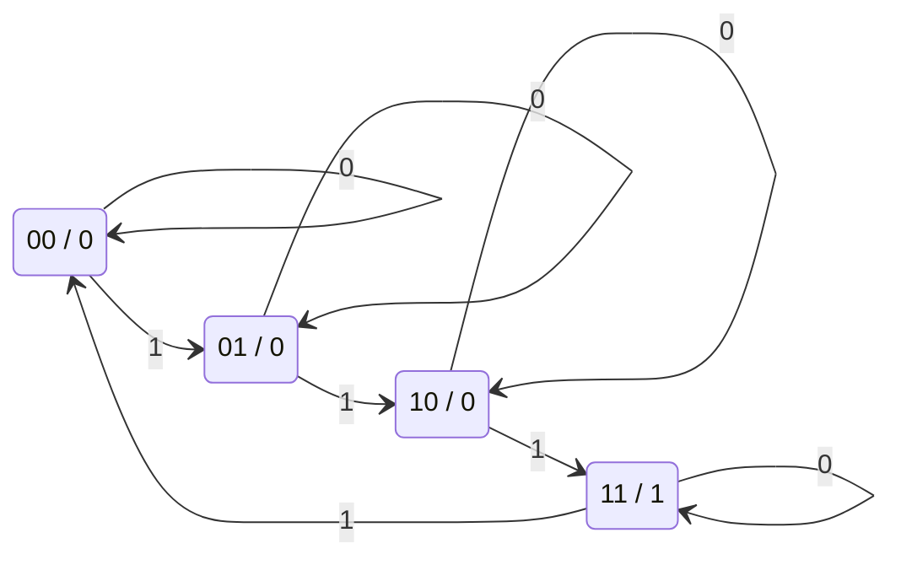
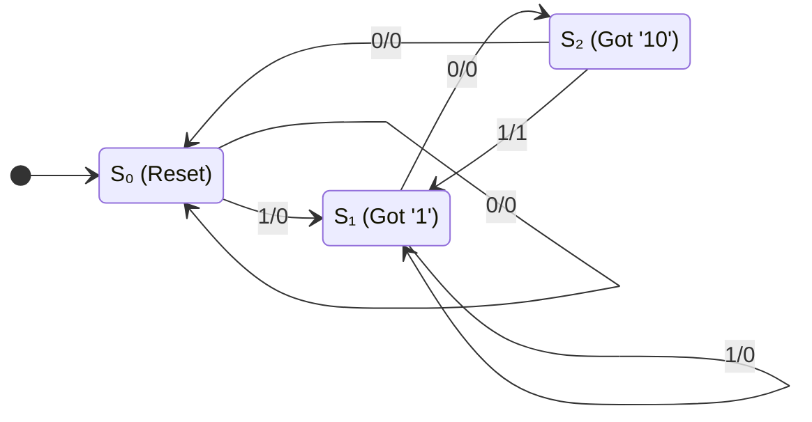

# Lecture 6: Latches, Flip-flops, & Synchronous Sequential Logic
{{ $slidev.configs.subject }}
<div class="abs-br m-6 text-sm">
010113025 Digital Circuits and Logic Design
</div>

---

## Outline

*   Sequential Circuits
*   Latches (SR, D)
*   Flip-Flops (D, JK, T)
    *   Level vs. Edge Triggering
    *   Master-Slave Flip-Flops
*   Characteristic Tables & Equations
*   Analysis of Clocked Sequential Circuits
    *   State Equations, State Tables, State Diagrams
*   Mealy and Moore Models
*   State Reduction & Assignment
*   Design of Sequential Circuits

---

## Sequential Circuits

Unlike combinational circuits, **sequential circuits** have memory.

*   They contain **memory elements** that store the circuit's **state**.
*   The outputs depend on the **current inputs AND the present state** of the memory elements.
*   The next state of the memory elements also depends on the current inputs and the present state.
*   This creates a **feedback path** from the memory elements back to the combinational logic.


---

## Synchronous vs. Asynchronous

*   **Synchronous Sequential Circuits:**
    *   State transitions happen at discrete moments in time, controlled by a clock signal.
    *   A master clock generator provides a periodic train of clock pulses.
    *   These are the most common type, as they are easier to design and avoid instability issues.
    *   The memory elements are **flip-flops**.

*   **Asynchronous Sequential Circuits:**
    *   State transitions can happen at any time, triggered by changes in the input signals.
    *   The memory elements are often simple **latches**.


---

## Latches

A **latch** is a basic memory element that can store one bit of information. It is a type of **bistable multivibrator**.

### Basic SR Latch (NOR Gates)
*   Built from two cross-coupled NOR gates.
*   `S` stands for Set, `R` stands for Reset.
*   `(S,R) = (0,0)`: **No change**. The latch holds its current state.
*   `(S,R) = (1,0)`: **Set**. Forces output `Q` to 1.
*   `(S,R) = (0,1)`: **Reset**. Forces output `Q` to 0.
*   `(S,R) = (1,1)`: **Invalid/Indeterminate**. Both `Q` and `Q'` become 0, which violates the `Q' = not(Q)` rule. This state should be avoided.


---

## SR Latch with Control Input (Gated SR Latch)

An SR latch can be modified to only change state when a control input `C` (or Enable) is active.

*   When `C = 0`, the inputs S and R have no effect. The latch holds its state.
*   When `C = 1`, the latch is enabled and behaves like a normal SR latch.

<div class="grid grid-cols-2 gap-8 items-center">


| C | S | R | Next State of Q |
|:-:|:-:|:-:|:----------------|
| 0 | X | X | No change       |
| 1 | 0 | 0 | No change       |
| 1 | 0 | 1 | Q = 0 (Reset)   |
| 1 | 1 | 0 | Q = 1 (Set)     |
| 1 | 1 | 1 | Indeterminate   |

</div>

---

## D Latch (Gated D Latch)

The D latch (Data latch) eliminates the indeterminate state of the SR latch.

*   It has one data input `D` and a control input `C`.
*   An inverter ensures that S and R are never equal to 1 at the same time.
*   When `C = 1`, the output `Q` follows the input `D`. The latch is "transparent".
*   When `C = 0`, the latch is closed and holds the last value of `D`.

**`Q(next) = D` (when C=1)**

<div class="grid grid-cols-2 gap-8 items-center">


| C | D | Next State of Q |
|:-:|:-:|:----------------|
| 0 | X | No change       |
| 1 | 0 | Q = 0 (Reset)   |
| 1 | 1 | Q = 1 (Set)     |

</div>

### VHDL Implementation (D Latch)

```vhdl
library ieee;
use ieee.std_logic_1164.all;

entity d_latch is
    port ( D, C : in  std_logic;
           Q    : out std_logic );
end d_latch;

architecture behavioral of d_latch is
begin
    process(C, D)
    begin
        if C = '1' then
            Q <= D;
        end if;
    end process;
end behavioral;
```

---

## Flip-Flops: Edge-Triggered vs. Level-Triggered

Latches are **level-triggered**: their output can change anytime the control input `C` is high. This can cause instability in synchronous circuits with feedback.

**Flip-flops** are **edge-triggered**: they only change state at a specific point on the clock signal.

*   **Positive-edge triggered:** Changes state on the rising edge of the clock (0 -> 1).
*   **Negative-edge triggered:** Changes state on the falling edge of the clock (1 -> 0).

This edge-triggered behavior prevents the multiple-transition problem and ensures all state changes in a system happen simultaneously.


---

## Edge-Triggered D Flip-Flop

The most common and efficient flip-flop. It captures the value of the D input at the active clock edge and stores it in Q.

### Master-Slave D Flip-Flop

One way to build an edge-triggered flip-flop is with a master-slave configuration.

*   Consists of two latches: a **master** (e.g., positive-level triggered) and a **slave** (e.g., negative-level triggered).
*   **When CLK=1:** The master latch is open and follows the D input. The slave latch is closed, holding the previous value.
*   **When CLK falls to 0:** The master latch closes, capturing the value of D. The slave latch opens, receiving the value from the master and outputting it on Q.

The output Q only changes on the **falling edge** of the clock.


### VHDL Implementation (D Flip-Flop)

```vhdl
library ieee;
use ieee.std_logic_1164.all;

entity d_ff is
    port ( D, CLK : in  std_logic;
           Q     : out std_logic );
end d_ff;

architecture behavioral of d_ff is
begin
    process(CLK)
    begin
        if rising_edge(CLK) then
            Q <= D;
        end if;
    end process;
end behavioral;
```

---

## Other Flip-Flop Types

Other flip-flops can be constructed from a D flip-flop and external gates.

### JK Flip-Flop
*   Inputs `J` (like Set) and `K` (like Reset).
*   `J=0, K=0`: Holds state.
*   `J=0, K=1`: Resets (Q=0).
*   `J=1, K=0`: Sets (Q=1).
*   `J=1, K=1`: **Toggles** the state (Q becomes Q'). This is the key advantage over an SR flip-flop.
*   **Characteristic Equation:** `Q(t+1) = JQ' + K'Q`

### T Flip-Flop (Toggle)
*   Single input `T`.
*   `T=0`: Holds state.
*   `T=1`: Toggles the state.
*   Useful for building counters.
*   **Characteristic Equation:** `Q(t+1) = T ⊕ Q`

---

## Flip-Flop Characteristic Tables & Equations

These define the next state `Q(t+1)` based on the current inputs and current state `Q(t)`.

<div class="grid grid-cols-2 gap-8">

<div>

### D Flip-Flop
`Q(t+1) = D`

| D | Q(t+1) |
|:-:|:------:|
| 0 |   0    |
| 1 |   1    |

### T Flip-Flop
`Q(t+1) = T ⊕ Q`

| T | Q(t) | Q(t+1) |
|:-:|:----:|:------:|
| 0 |  Q   |    Q   |
| 1 |  Q   |   Q'   |

</div>

<div>

### JK Flip-Flop
`Q(t+1) = JQ' + K'Q`

| J | K | Q(t+1) |
|:-:|:-:|:------:|
| 0 | 0 |  Q(t)  |
| 0 | 1 |   0    |
| 1 | 0 |   1    |
| 1 | 1 |  Q'(t) |

</div>

</div>

---

## Analysis of Clocked Sequential Circuits

Analysis is the process of determining the function of a sequential circuit from its logic diagram. The goal is to derive a **state table** or **state diagram**.

**Procedure:**
1.  Determine the **flip-flop input equations** (also called excitation equations) and the **output equations** from the combinational logic part of the circuit.
2.  Use these equations and the flip-flop characteristic equations to derive the **next state equations**.
    *   `A(t+1) = Dₐ` for a D flip-flop.
    *   `A(t+1) = JₐA' + Kₐ'A` for a JK flip-flop.
3.  Construct a **state table** that lists the next state and output for every combination of present state and input.
4.  (Optional) Draw a **state diagram**, which is a graphical representation of the state table.

---

## Analysis Example

Let's analyze the following circuit with two D flip-flops (A and B), one input (x), and one output (y).


1.  **Flip-Flop Input & Circuit Output Equations:**
    *   `Dₐ = A(t)x(t) + B(t)x(t)`
    *   `Dₑ = A'(t)x(t)`
    *   `y(t) = (A(t) + B(t))x'(t)`

2.  **Next State Equations (since they are D flip-flops):**
    *   `A(t+1) = Ax + Bx`
    *   `B(t+1) = A'x`

---

## Analysis Example: State Table

3.  **Construct the State Table:** We fill in the table using the next state and output equations for all combinations of present state (A, B) and input (x).

| Present State | Input | Next State | Output |
|:-------------:|:-----:|:----------:|:------:|
| **A B**       | **x** | **A B**    | **y**  |
| 0 0           | 0     | 0 0        | 0      |
| 0 0           | 1     | 0 1        | 0      |
| 0 1           | 0     | 0 0        | 1      |
| 0 1           | 1     | 1 1        | 0      |
| 1 0           | 0     | 0 0        | 1      |
| 1 0           | 1     | 1 0        | 0      |
| 1 1           | 0     | 0 0        | 1      |
| 1 1           | 1     | 1 0        | 0      |

---

## Analysis Example: State Diagram

4.  **Draw the State Diagram:**
    *   Each circle represents a state (the value of the flip-flops, AB).
    *   Each arrow represents a transition between states.
    *   The label on the arrow is in the format `input / output`.
    


This completes the analysis. The state diagram fully describes the circuit's behavior over time.

---
layout: two-cols-header
---

## Analysis with JK Flip-Flops

The procedure is similar, but we use the JK flip-flop's characteristic equation: `Q(t+1) = JQ' + K'Q`.

::left::


1.  **Input Equations:**
    *   `Jₐ = B`
    *   `Kₐ = Bx'`
    *   `Jₑ = x'`
    *   `Kₑ = A'x + Ax' = A ⊕ x`

2.  **Next State Equations:**
    *   `A(t+1) = JₐA' + Kₐ'A = BA' + (Bx')'A`
    *   `B(t+1) = JₑB' + Kₑ'B = x'B' + (A ⊕ x)'B`

::right::

3.  **State Table:**

| Present State | Input | Next State |
|:-------------:|:-----:|:----------:|
| **A B**       | **x** | **A B**    |
| 0 0           | 0     | 0 1        |
| 0 0           | 1     | 0 0        |
| 0 1           | 0     | 1 1        |
| 0 1           | 1     | 1 0        |
| 1 0           | 0     | 0 1        |
| 1 0           | 1     | 1 0        |
| 1 1           | 0     | 0 0        |
| 1 1           | 1     | 1 1        |

4.  **State Diagram:**



---
layout: two-cols-header
---

## Analysis with T Flip-Flops

Here, we use the T flip-flop's characteristic equation: `Q(t+1) = T ⊕ Q`.

::left::


1.  **Input & Output Equations:**
    *   `Tₐ = Bx`
    *   `Tₑ = x`
    *   `y = AB`

2.  **Next State Equations:**
    *   `A(t+1) = Tₐ ⊕ A = (Bx) ⊕ A`
    *   `B(t+1) = Tₑ ⊕ B = x ⊕ B`

::right::

3.  **State Table:**

| Present State | Input | Next State | Output |
|:-------------:|:-----:|:----------:|:------:|
| **A B**       | **x** | **A B**    | **y**  |
| 0 0           | 0     | 0 0        | 0      |
| 0 0           | 1     | 0 1        | 0      |
| 0 1           | 0     | 0 1        | 0      |
| 0 1           | 1     | 1 0        | 0      |
| 1 0           | 0     | 1 0        | 0      |
| 1 0           | 1     | 1 1        | 0      |
| 1 1           | 0     | 1 1        | 1      |
| 1 1           | 1     | 0 0        | 1      |

4.  **State Diagram (Moore Model):**



---

## Mealy and Moore Models

Sequential circuits are classified into two models based on how their outputs are generated.

### Mealy Model
*   The outputs are a function of both the **present state AND the current inputs**.
*   The output value is written on the transition arrow in the state diagram (`input / output`).
*   Outputs can change immediately if the input changes, even between clock edges. This can sometimes lead to momentary false outputs.

### Moore Model
*   The outputs are a function of the **present state ONLY**.
*   The output value is written inside the state circle (`state / output`).
*   Outputs are synchronous with the clock; they only change when the state changes.


---

## Design of Sequential Circuits

Design is the reverse of analysis. We start with a specification and end with a logic diagram.

**Procedure:**
1.  Create a **state diagram** from the problem description.
2.  Perform **state reduction** to eliminate redundant states.
3.  Perform **state assignment** to assign unique binary codes to each state.
4.  Create the binary-coded **state table**.
5.  Choose the **type of flip-flop** to use (D, JK, T).
6.  Derive the simplified **flip-flop input equations** and **output equations** (using K-maps).
7.  Draw the final **logic diagram**.

---

## Design Example: Sequence Detector

1.  **Problem & State Diagram:** Design a circuit that outputs `y=1` when it detects the sequence of inputs `101` on input `x`.

    **State Diagram:** We need states to remember "have seen nothing", "have seen a 1", "have seen 10".
    *   `S₀`: Initial state (reset).
    *   `S₁`: Last input was `1`.
    *   `S₂`: Last two inputs were `10`.
    *   If in `S₂` and we get a `1`, the sequence is complete, so output `1`.



---

## Synthesis with D Flip-Flops

2.  **State Reduction:** The diagram has no redundant states. (We will cover this in more detail later).
3.  **State Assignment:** `S₀=00`, `S₁=01`, `S₂=10`. (We need 2 flip-flops, A and B).
4.  **Binary State Table:**

| Present State | Input | Next State | Output |
|:-------------:|:-----:|:----------:|:------:|
| **A B**       | **x** | **A B**    | **y**  |
| 0 0           | 0     | 0 0        | 0      |
| 0 0           | 1     | 0 1        | 0      |
| 0 1           | 0     | 1 0        | 0      |
| 0 1           | 1     | 0 1        | 0      |
| 1 0           | 0     | 0 0        | 0      |
| 1 0           | 1     | 0 1        | 1      |

5.  **Derive Equations (from K-maps):** For D flip-flops, the input equation is simply the next state value.
    *   `Dₐ = A(t+1) = Bx'`
    *   `Dₑ = B(t+1) = x`
    *   `y = Ax`

6.  **Draw the Logic Diagram:**


### VHDL Implementation

```vhdl
library ieee;
use ieee.std_logic_1164.all;

entity sequence_detector is
    port ( clk, reset : in  std_logic;
           x         : in  std_logic;
           y         : out std_logic );
end sequence_detector;

architecture fsm of sequence_detector is
    type state_type is (S0, S1, S2);
    signal current_state, next_state : state_type;
begin
    -- State Register (Sequential)
    process(clk, reset)
    begin
        if reset = '1' then
            current_state <= S0;
        elsif rising_edge(clk) then
            current_state <= next_state;
        end if;
    end process;

    -- Next State & Output Logic (Combinational)
    process(current_state, x)
    begin
        y <= '0'; -- Default output
        case current_state is
            when S0 => if x = '1' then next_state <= S1; else next_state <= S0; end if;
            when S1 => if x = '0' then next_state <= S2; else next_state <= S1; end if;
            when S2 => if x = '1' then y <= '1'; next_state <= S1; else next_state <= S0; end if;
        end case;
    end process;
end fsm;
```

---

## Flip-Flop Excitation Tables

For JK and T flip-flops, we need **excitation tables**. They tell us what the flip-flop inputs (J, K, or T) must be to cause a specific state transition from `Q(t)` to `Q(t+1)`.

<div class="grid grid-cols-2 gap-8">

<div>

### JK Excitation Table

| Q(t) | Q(t+1) | J | K |
|:----:|:------:|:-:|:-:|
|  0   |    0   | 0 | X |
|  0   |    1   | 1 | X |
|  1   |    0   | X | 1 |
|  1   |    1   | X | 0 |

</div>

<div>

### T Excitation Table

| Q(t) | Q(t+1) | T |
|:----:|:------:|:-:|
|  0   |    0   | 0 |
|  0   |    1   | 1 |
|  1   |    0   | 1 |
|  1   |    1   | 0 |

</div>
</div>

---

## Synthesis with JK Flip-Flops

Let's synthesize the same sequence detector using JK flip-flops.

1.  **Create the Excitation Table:** We add columns for the JK inputs and fill them in by looking at the state transitions for A and B.

| PS | Input | NS | Flip-Flop Inputs |
|:----:|:-----:|:----:|:----------------:|
| A B  |   x   | A B  | Jₐ Kₐ | Jₑ Kₑ |
| 0 0  |   0   | 0 0  | 0  X  | 0  X  |
| 0 0  |   1   | 0 1  | 0  X  | 1  X  |
| 0 1  |   0   | 1 0  | 1  X  | X  1  |
| 0 1  |   1   | 0 1  | 0  X  | X  0  |
| 1 0  |   0   | 0 0  | X  1  | 0  X  |
| 1 0  |   1   | 0 1  | X  1  | 1  X  |

2.  **Derive Equations (from K-maps):**
    *   `Jₐ = Bx'`
    *   `Kₐ = x`
    *   `Jₑ = x`
    *   `Kₑ = x'`
    *   `y = Ax` (same as before)

3.  **Draw the Logic Diagram:**


---

## Synthesis with T Flip-Flops: Binary Counter

**Problem:** Design a 3-bit binary counter. This circuit has no inputs (besides the clock) and cycles through states 000 to 111.

1.  **State Table & Excitations:**

| Present State | Next State | Flip-Flop Inputs |
|:-------------:|:----------:|:----------------:|
| A₂ A₁ A₀      | A₂ A₁ A₀   | Tₐ₂ Tₐ₁ Tₐ₀      |
| 0  0  0       | 0  0  1    | 0   0   1        |
| 0  0  1       | 0  1  0    | 0   1   1        |
| 0  1  0       | 0  1  1    | 0   0   1        |
| 0  1  1       | 1  0  0    | 1   1   1        |
| 1  0  0       | 1  0  1    | 0   0   1        |
| 1  0  1       | 1  1  0    | 0   1   1        |
| 1  1  0       | 1  1  1    | 0   0   1        |
| 1  1  1       | 0  0  0    | 1   1   1        |

2.  **Derive Equations (from K-maps):**
    *   `Tₐ₂ = A₁A₀`
    *   `Tₐ₁ = A₀`
    *   `Tₐ₀ = 1`

3.  **Draw the Logic Diagram:**

