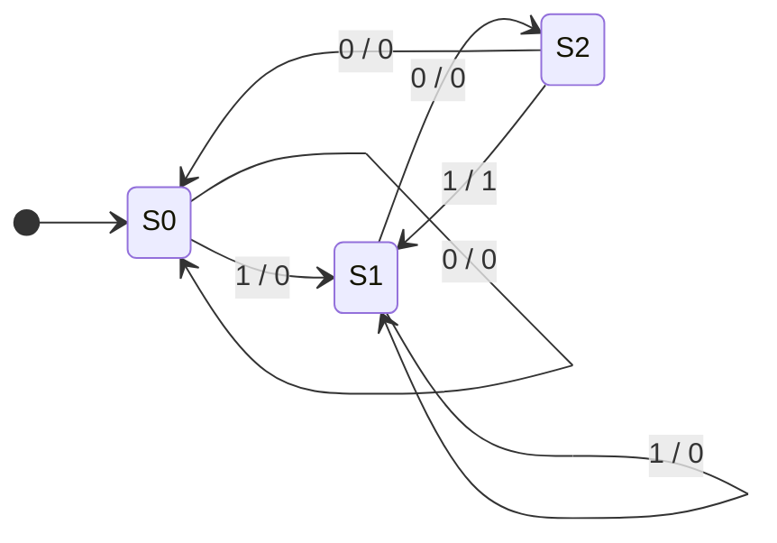

# Lecture 8: Finite State Machines
{{ $slidev.configs.subject }}


{{ $slidev.configs.author }}
---
hideInToc: false
---

## Outline

<toc mode="onlySiblings" minDepth="2" columns="2"/>

---


## Finite State Machine (FSM): Recall

<div class="grid grid-cols-2 gap-8 text-base">

<div>

A **Finite State Machine (FSM)** is a computation model used to design sequential circuits.
*   It consists of a finite number of **states**.
*   It transitions between states based on **inputs** and the **current state**.
*   It produces **outputs** based on the state (and potentially inputs).


</div>

<div>


An FSM consists of three main parts:
1.  **Next State Logic:** Combinational logic that determines the next state.
2.  **State Memory:** Flip-flops that store the current state.
3.  **Output Logic:** Combinational logic that generates outputs.


</div>

</div>


<div class="text-center text-sm opacity-50 mt-2">Figure 8-1: General Block Diagram of an FSM</div>

---

## FSM Models: Moore vs. Mealy

There are two primary types of FSMs, distinguished by how their outputs are generated.

<div class="grid grid-cols-2 gap-8 mt-4">

<div>

### Moore Machine
Output depends **only on the current state**.
*   $Output = f(Current\_State)$
*   Outputs change synchronously with state transitions.
*   **Pros:** Simpler output logic, safer glitch-free outputs.


<div class="text-center text-sm opacity-50 mt-2">Figure 8-2: Moore Machine Diagram</div>

</div>

<div>

### Mealy Machine
Output depends on **current state AND current inputs**.
*   $Output = f(Current\_State, Inputs)$
*   Outputs can change immediately when inputs change.
*   **Pros:** Fewer states often needed, faster response.


<div class="text-center text-sm opacity-50 mt-2">Figure 8-3: Mealy Machine Diagram</div>

</div>
</div>

---
layout: two-cols-header
---

## FSM Analysis Procedure

**Analysis** is determining the behavior of a given sequential circuit.

:: left ::

### Steps:
1.  **Determine Logic Equations:**
    *   Find Next State equations ($D_i, J_i, K_i, T_i$) from the circuit.
    *   Find Output equations ($Z$).
2.  **Construct State Transition Table:**
    *   List all possible Present States and Inputs.
    *   Calculate Next States and Outputs.
3.  **Draw State Diagram:**
    *   Represent states as nodes.
    *   Represent transitions as directed edges labeled with `Input / Output`.

:: right ::


<div class="text-center text-sm opacity-50 mt-2">Figure 8-2: Example Circuit</div>

**Equations:**
*   $D_A = A \oplus x \oplus y$
*   $z = A \cdot x$


---

**State Table:**

<div class="text-sm">

$$
\begin{array}{|c|c|c|c|c|}
\hline
\text{PS } (A) & \text{Inputs } (x \ y) & D_A = A \oplus x \oplus y & \text{NS } (A_{next}) & \text{Output } (z = A \cdot x) \\
\hline
0 & 0 \quad 0 & 0 & 0 & 0 \\
0 & 0 \quad 1 & 1 & 1 & 0 \\
0 & 1 \quad 0 & 1 & 1 & 0 \\
0 & 1 \quad 1 & 0 & 0 & 0 \\
1 & 0 \quad 0 & 1 & 1 & 0 \\
1 & 0 \quad 1 & 0 & 0 & 0 \\
1 & 1 \quad 0 & 0 & 0 & 1 \\
1 & 1 \quad 1 & 1 & 1 & 1 \\
\hline
\end{array}
$$

</div>

**State Diagram:**


---

## FSM Synthesis (Design) Procedure

**Synthesis** is the process of creating a circuit from a description of its behavior.

1.  **Understand specifications:** Define inputs, outputs, and start state.
2.  **Create State Diagram:** Model the behavior.
3.  **create State Table:** Tabulate transitions.
4.  **State Minimization (Optional):** Remove redundant states to simplify logic.
5.  **State Assignment:** Assign binary codes to states.
6.  **Flip-Flop Selection:** Choose D, JK, or T flip-flops.
7.  **Derive Logic Equations:** Use K-maps to find equations for flip-flop inputs and FSM outputs.
8.  **Draw Logic Diagram.**

---

## Design Example

**Problem:** Design a generic FSM.

<div class="grid grid-cols-2 gap-8 text-base">

<div>

### 1. State Diagram
Let's assume a design requirement leads to this diagram:


### 2. State Table

$$
\begin{array}{|c|c|c|}
\hline
\text{Present State} & \text{Input} & \text{Next State} \\
\hline
S_0 & 0 & S_0 \\
S_0 & 1 & S_1 \\
S_1 & 0 & S_0 \\
S_1 & 1 & S_1 \\
\hline
\end{array}
$$

</div>

<div>

### 3. State Equations

*   Assume State Encoding: $S_0 = 0, S_1 = 1$. Let $A$ be the state variable.
*   From the table: $A_{next} = 1$ when $x=1$; $A_{next} = 0$ when $x=0$.
*   Equation: $D_A = A_{next} = x$

### 4. Logic Diagram


</div>

</div>

---

## Design Example: 2-Bit Up/Down Counter

**Problem:** Design a synchronous 2-bit counter that counts up when input $x=1$ and down when $x=0$.

<div class="grid grid-cols-2 gap-8 text-sm">
<div>

### 1. State Diagram & Table
*   **States:** 00, 01, 10, 11
*   **Transitions:**
    *   $x=1$: $00 \to 01 \to 10 \to 11 \to 00$
    *   $x=0$: $00 \to 11 \to 10 \to 01 \to 00$


**State Table**


$$
\begin{array}{|c|c|c|cc|cc|}
\hline
\text{PS } (Q_1 Q_0) & \text{Input } (x) & \text{NS } (Q_1^+ Q_0^+) & J_1 & K_1 & J_0 & K_0 \\
\hline
0 \quad 0 & 0 & 1 \quad 1 & 1 & X & 1 & X \\
0 \quad 0 & 1 & 0 \quad 1 & 0 & X & 1 & X \\
0 \quad 1 & 0 & 0 \quad 0 & 0 & X & X & 1 \\
0 \quad 1 & 1 & 1 \quad 0 & 1 & X & X & 1 \\
1 \quad 0 & 0 & 0 \quad 1 & X & 1 & 1 & X \\
1 \quad 0 & 1 & 1 \quad 1 & X & 0 & 1 & X \\
1 \quad 1 & 0 & 1 \quad 0 & X & 0 & X & 1 \\
1 \quad 1 & 1 & 0 \quad 0 & X & 1 & X & 1 \\
\hline
\end{array}
$$

</div>
<div>

**Logic Equations (JK Flip-Flops)**

We use K-maps to solve for $J$ and $K$ inputs:


</div>

</div>

---

<div class="grid grid-cols-3 gap-8 text-sm">
<div>

From the K-maps:
*   **For $Q_0$:** All entries are 1 or X.
    *   $J_0 = 1, \quad K_0 = 1$
*   **For $Q_1$:**
    *   $J_1 = x \odot Q_0 = \overline{x \oplus Q_0}$
    *   $K_1 = x \odot Q_0 = \overline{x \oplus Q_0}$


### 2. Logic Diagram

Based on the derived equations:
*   $FF_0$: $J=1, K=1$
*   $FF_1$: $J=K= \overline{x \oplus Q_0}$

</div>
<div class="col-span-2">


<div class="text-center text-sm opacity-50 mt-2">Figure 8-3: Logic Diagram of 2-Bit Up/Down Counter</div>

</div>
</div>


---
layout: two-cols-header
---

## Design Example 2: Car Security System
:: left ::
**Problem:** Design a controller for a car security system.
*   **Inputs:** `Master` switch (M), `Door` sensor (D), `Vibration` sensor (V).
*   **Outputs:** `Alarm` (A).
*   **Behavior:**
    *   System is initially **Disarmed** (No Siren).
    *   If M=1, go to **Armed** (Siren OFF).
    *   If Armed (M=1) AND (Door=1 OR Vibration=1), go to **Siren** state.
    *   Once in **Siren** state, stay there until M=0 (Reset).

::right::

### State Diagram


### State Table

$$
\begin{array}{|c|ccc|c|c|}
\hline
\text{State } Q & M & D & V & \text{Next State } Q_{next} & \text{Output } A \\
\hline
0 \text{ (No Siren)} & 0 & X & X & 0 & 0 \\
0 \text{ (No Siren)} & 1 & 0 & 0 & 0 & 0 \\
0 \text{ (No Siren)} & 1 & 1 & X & 1 & 0 \\
0 \text{ (No Siren)} & 1 & X & 1 & 1 & 0 \\
\hline
1 \text{ (Siren)} & 0 & X & X & 0 & 1 \\
1 \text{ (Siren)} & 1 & X & X & 1 & 1 \\
\hline
\end{array}
$$

---
layout: two-cols-header
---

### Logic Synthesis

:: left ::

We derive the Next State equation from Karnaugh maps:


**Equation:**
*   $Q_{next} = M \cdot (Q + D + V)$
*   $A = Q$

:: right ::

### Logic Diagram


<div class="text-center text-sm opacity-50 mt-2">Figure 8-4: Car Security Logic Diagram</div>

---

### VHDL Implementation (Logic)

```vhdl{*}{maxHeight:'420px',lines:true}
    -- Next State Logic
    process(clk, reset)
    begin
        if reset = '1' then
            current_state <= No_Siren;
        elsif rising_edge(clk) then
            current_state <= next_state;
        end if;
    end process;

    -- Combinational Logic
    process(current_state, M, D, V)
    begin
        next_state <= current_state; 
        Alarm <= '0';
        
        case current_state is
            when No_Siren =>
                if M='1' and (D='1' or V='1') then 
                    next_state <= Siren; 
                end if;
            when Siren =>
                Alarm <= '1';
                if M='0' then 
                    next_state <= No_Siren; 
                end if;
        end case;
    end process;
```

---

## Design Example 3: Modulo-6 Up-Counter

**Problem:** Design a synchronous count-up counter that counts from 0 to 5 and repeats.

<div class="grid grid-cols-2 gap-8">
<div>

### 1. State Diagram & Table
*   **States:** 000, 001, 010, 011, 100, 101.
*   **Transitions:** $0 \to 1 \to 2 \to 3 \to 4 \to 5 \to 0$.


</div>
<div class="text-sm">

**State Table**
*   **Input:** $C$ (Count Enable)
*   **State:** $Q_2, Q_1, Q_0$
*   **Output:** $Y = 1$ when State = 5 ($101$)

$$
\begin{array}{|c|c|c|c|}
\hline
\text{PS } (Q_2 Q_1 Q_0) & \text{NS } (C=0) & \text{NS } (C=1) & \text{Output } Y \\
\hline
0 \quad 0 \quad 0 & 0 \quad 0 \quad 0 & 0 \quad 0 \quad 1 & 0 \\
0 \quad 0 \quad 1 & 0 \quad 0 \quad 1 & 0 \quad 1 \quad 0 & 0 \\
0 \quad 1 \quad 0 & 0 \quad 1 \quad 0 & 0 \quad 1 \quad 1 & 0 \\
0 \quad 1 \quad 1 & 0 \quad 1 \quad 1 & 1 \quad 0 \quad 0 & 0 \\
1 \quad 0 \quad 0 & 1 \quad 0 \quad 0 & 1 \quad 0 \quad 1 & 0 \\
1 \quad 0 \quad 1 & 1 \quad 0 \quad 1 & 0 \quad 0 \quad 0 & 1 \\
\text{Others} & \text{X X X} & \text{X X X} & \text{X} \\
\hline
\end{array}
$$


</div>
</div>

---
layout: two-cols-header
---

### 2. Logic Synthesis

:: left ::

We assume **D Flip-Flops**.


:: right ::

**Equations:**
*   $D_2 = Q_2 Q_0' + Q_2 C' + Q_1 Q_0 C$
*   $D_1 = Q_1 C' + Q_1 Q_0' + \bar{Q_2}\bar{Q_1}Q_0 C$
*   $D_0 = Q_0 \oplus C$
*   $Y = Q_2 Q_1' Q_0$

---

### 3. Logic Diagram


<div class="text-center text-sm opacity-50 mt-2">Figure 8-5: Modulo-6 Counter Logic Diagram</div>

---

**VHDL Implementation**
```vhdl
process(clk, reset)
begin
    if reset='1' then
        count <= "000";
    elsif rising_edge(clk) then
        if count = "101" then
            count <= "000";
        else
            count <= count 
            + 1;
        end if;
    end if;
end process;
```


---

## Design Example 4: One-Shot Circuit

**Problem:** Design a circuit that produces an output pulse $S=1$ for exactly one clock cycle when an input button $B$ is pressed.

*   Debouncing logic is assumed.
*   The circuit waits for $B=1$ to go to a "Pulse" state, then proceeds to a "Wait" state until $B=0$.

### State Diagram


*   **S0:** Wait for valid Press ($B=1$).
*   **S1:** Output $S=1$ (Pulse). Immediate transition to S2 on next clock.
*   **S2:** Wait for $B=0$ to transition back to S0.

---

### State Table

$$
\begin{array}{|c|c|c|c|}
\hline
\text{PS } (Q_1 Q_0) & \text{Next State } (B=0) & \text{Next State } (B=1) & \text{Output } S (B=1) \\
\hline
\text{S0 (00)} & 00 & 01 & 1 \\
\text{S1 (01)} & 10 & 10 & 0 \\
\text{S2 (10)} & 00 & 10 & 0 \\
\text{Unused (11)} & 00 & 00 & 0 \\
\hline
\end{array}
$$

---

### Logic Synthesis

From the Next State table, we derive the K-maps for $D_1, D_0$ and Output $S$. Note that the unused state $11$ resets to $00$.


**Equations:**
*   $D_1 = Q_1' Q_0 + Q_1 Q_0' B$
*   $D_0 = Q_1' Q_0' B$
*   $S = Q_1' Q_0' B$

---

### Logic Diagram


<div class="text-center text-sm opacity-50 mt-2">Figure 8-6: One-Shot Circuit Logic Diagram</div>

---

---

## Design Example 5: Simple Microprocessor Control Unit

**Problem:** Design a control unit for a simple CPU that executes instructions: Fetch $\to$ Decode $\to$ Execute.

*   **Inputs:** `Opcode`, `ZeroFlag`, `Clock`.
*   **Outputs:** `PC_Load`, `IR_Load`, `ALU_Op`, `Reg_Write`.

### State Diagram Strategy
1.  **Fetch:** Load instruction from memory to IR. (`IR_Load=1`, `PC_Inc=1`) $\to$ Go to Decode.
2.  **Decode:** Analyze Opcode. Transitions to specific Execute states (ADD, LOAD, STORE, JUMP).
3.  **Execute:** Perform operation (e.g., `ALU_Op=Add`, `Reg_Write=1`). $\to$ Go back to Fetch.

*(Detailed diagrams for simple CPUs typically involve 10+ states, this highlights the concept.)*

---

## Design Example 6: Elevator Controller

**Problem:** Controller for a simple 2-floor elevator.

*   **Inputs:** Button 1 ($B_1$), Button 2 ($B_2$), Limit Switch 1 ($L_1$, floor 1), Limit Switch 2 ($L_2$, floor 2).
*   **Outputs:** Motor Up ($M_{up}$), Motor Down ($M_{down}$), Door Open ($DO$).

### Moore Machine Approach
*   States represent the physical status: **Floor 1 Open**, **Floor 1 Closed**, **Moving Up**, **Moving Down**, **Floor 2 Open**, **Floor 2 Closed**.
*   Output depends only on state (e.g., if in **Moving Up**, $M_{up}=1$).

### Mealy Machine Approach
*   States might be fewer (e.g., just **Floor 1**, **Floor 2**).
*   Output depends on input (e.g., If at Floor 1 and $B_2$ pressed, immediately output $M_{up}=1$).

---

## Application 3: Sequence Detector (101)

**Spec:** Detect the sequence "101" (overlapping allowed). Output $Z=1$ when detected.

### State Diagram (Mealy)
*   **S0:** Reset/Nothing
*   **S1:** Got '1'
*   **S2:** Got '10'


*Note: The transition S2 -> S1 on input 1 outputs 1 because "10" followed by "1" completes "101".*

---

## VHDL Implementation of FSMs

FSMs are typically implemented in VHDL using **three processes** (or two):

1.  **State Register Process:** Synchronous reset and clock edge detection. Update `current_state` with `next_state`.
2.  **Next State Logic Process:** Combinational process sensitive to `current_state` and inputs. Determines `next_state`.
3.  **Output Logic Process:** Combinational process determining outputs. (Can be merged with Next State logic).

### Template (State Register)

```vhdl
process(clk, reset)
begin
    if reset = '1' then
        current_state <= S0;
    elsif rising_edge(clk) then
        current_state <= next_state;
    end if;
end process;
```

---

### Template (Next State & Output Logic)

```vhdl
process(current_state, input_signal)
begin
    -- Default assignments
    next_state <= current_state;
    output_signal <= '0';
    
    case current_state is
        when S0 =>
            if input_signal = '1' then
                next_state <= S1;
            end if;
        when S1 =>
            -- Logic for S1
            output_signal <= '1'; -- Moore output example
        when others =>
            next_state <= S0;
    end case;
end process;
```

---

## Example: Vending Machine

**Scenario:** Dispense item (15¢) for Nickels (5¢) and Dimes (10¢). Give change.

### VHDL Entity
```vhdl
entity vending_machine is
    port ( clk, rst : in std_logic;
           N, D     : in std_logic; -- Nickel, Dime inputs
           Disp     : out std_logic; -- Dispense
           Change   : out std_logic ); -- Give 5c change
end vending_machine;
```

---

### VHDL Architecture

```vhdl {*}{maxHeight:'400px'}
architecture Behavioral of vending_machine is
    type state_type is (S0, S5, S10); -- 0c, 5c, 10c credit
    signal current_state, next_state : state_type;
begin
    -- 1. State Register
    process(clk, rst)
    begin
        if rst = '1' then current_state <= S0;
        elsif rising_edge(clk) then current_state <= next_state;
        end if;
    end process;

    -- 2. Next State & Output Logic
    process(current_state, N, D)
    begin
        next_state <= current_state; Disp <= '0'; Change <= '0'; -- Defaults
        case current_state is
            when S0 =>
                if N='1' then next_state <= S5;
                elsif D='1' then next_state <= S10; end if;
            when S5 =>
                if N='1' then next_state <= S10;
                elsif D='1' then next_state <= S0; Disp <= '1'; end if;
            when S10 =>
                if N='1' then next_state <= S0; Disp <= '1';
                elsif D='1' then next_state <= S5; Disp <= '1'; Change <= '1'; end if;
        end case;
    end process;
end Behavioral;
```

---

## Summary

*   **Finite State Machines (FSMs)** are accurate models for sequential logic.
*   **Moore vs. Mealy:** Moore outputs depend on state only; Mealy on state and inputs.
*   **Analysis:** Circuit $\to$ State Diagram.
*   **Synthesis:** Specification $\to$ State Diagram $\to$ Logic Circuit.
*   **Optimization:** Reduces hardware cost via state reduction and prudent encoding.
*   **VHDL:** Implemented using standard templates separating sequential (state memory) and combinational (next state/output) logic.