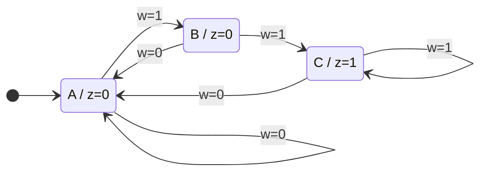
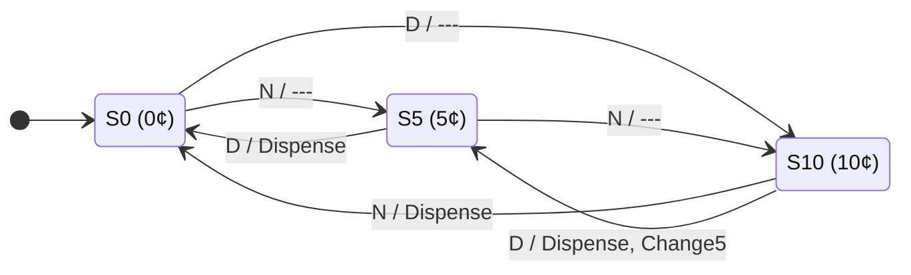
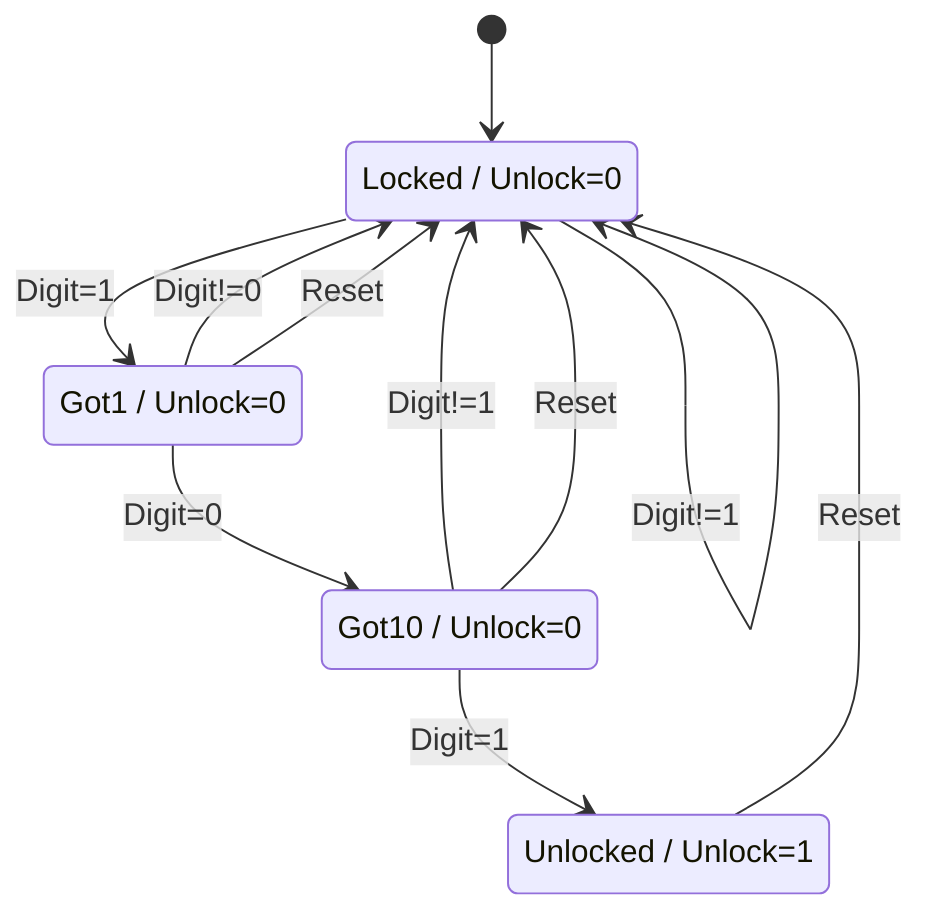

# Lecture 8: Finite State Machines and Register Transfer Level Design
{{ $slidev.configs.subject }}

{{ $slidev.configs.author }}
---

## Outline

*   FSM Design Recap
*   Application 1: Sequence Detector
*   Application 2: Simple Vending Machine
*   Application 3: Security Door Lock
*   Application 4: Datapath Control Unit

---

## FSM Design Recap

A Finite State Machine (FSM) is a model of computation used to design sequential logic circuits. Its behavior can be represented by a finite number of states.

### Basic Design Steps
1.  **Specify Desired Circuit:** Clearly define inputs, outputs, and behavior.
2.  **Create State Diagram:** Visualize the states and transitions.
3.  **Create State Table:** Tabulate the state diagram's information.
4.  **Perform State Reduction (Optional):** Eliminate redundant states.
5.  **Perform State Assignment:** Assign binary codes to each state.
6.  **Choose Flip-Flop Type:** (D, JK, T) and derive logic equations.
7.  **Draw Logic Diagram:** Implement the circuit.

### Moore Machine
Outputs depend **only on the present state**.

### Mealy Machine
Outputs depend on the **present state AND current inputs**.

---

## Application 1: Sequence Detector

**Problem:** Design a Moore FSM that asserts its output `z=1` when it detects two consecutive `1`s on its input `w`.

### State Diagram
*   **State A (Reset):** No `1`s have been seen yet. Output `z=0`.
*   **State B (Got one '1'):** The last input was a `1`. Output `z=0`.
*   **State C (Got two '1's):** The last two inputs were `1`s. Output `z=1`.

This is a fundamental application used in pattern recognition, communication protocols, and command decoders.

---

## Application 2: Simple Vending Machine

**Problem:** Design a Mealy FSM for a vending machine that accepts 5¢ (Nickel) and 10¢ (Dime) coins. An item costs 15¢. The machine gives change if necessary.

### State Diagram
*   **Inputs:** `N` (Nickel), `D` (Dime).
*   **Outputs:** `Dispense` (item), `Change5` (5¢ change).
*   **States:** `S0` (0¢), `S5` (5¢), `S10` (10¢).

---

## Vending Machine: State Table

This table represents the logic from the state diagram. From here, we could assign binary values to the states (e.g., S0=00, S5=01, S10=10) and derive the logic for the flip-flops and outputs.

| Present State | Input | Next State | Output (Dispense, Change5) |
|:-------------:|:-----:|:----------:|:--------------------------:|
| S0            | N     | S5         | 0, 0                       |
| S0            | D     | S10        | 0, 0                       |
| S5            | N     | S10        | 0, 0                       |
| S5            | D     | S0         | 1, 0                       |
| S10           | N     | S0         | 1, 0                       |
| S10           | D     | S5         | 1, 1                       |

---

## Application 3: Security Door Lock

**Problem:** Design a Moore FSM for a simple digital lock. The lock opens (`Unlock=1`) if the 3-digit sequence `1-0-1` is entered on a keypad. A `Reset` button returns it to the initial locked state.

### State Diagram
*   **Input:** `Digit` (from keypad), `Reset`.
*   **Output:** `Unlock`.
*   **States:** `Locked`, `Got1`, `Got10`.

---

## RTL Component: Register File

A **Register File** is a collection of registers with common read and write ports, packaged as a single fast memory unit.

*   **Read Access:** Typically has two read ports allowing two registers to be read simultaneously (Selection via `Read Reg 1` and `Read Reg 2`).
*   **Write Access:** Has one write port (Selection via `Write Reg`, Data via `Write Data`).
*   **Control:** `RegWrite` enables the write operation on the clock edge.

Figure 8-2: Register File with 2 Read Ports and 1 Write Port

---

## RTL Component: Arithmetic Logic Unit (ALU)

The **ALU** is the computational heart of the CPU. It is a combinational logic circuit that performs arithmetic and logical operations.

*   **Inputs:** Operands A and B.
*   **Output:** Result.
*   **Control:** Selects the operation (e.g., ADD, SUB, AND, OR).
*   **Status Flags:**
    *   **Zero (Z):** Set if Result is 0.
    *   **Overflow (V):** Set if signed arithmetic overflow occurs.

---

Figure 8-3: Arithmetic Logic Unit (ALU)

---

## Register Transfer Level (RTL) Design

**RTL Design** is a methodology for defining digital systems by describing the flow of data between registers and the operations performed on that data.

*   **Registers:** Store the state of the system.
*   **Combinational Logic (e.g., ALU):** Performs operations.
*   **Buses:** Transfer data between components.

### Notation (RTL)

*   **Transfer:** $R2 \leftarrow R1$ (Copy contents of R1 to R2)
*   **Operation:** $R1 \leftarrow R1 + R2$ (Add R1 and R2, store in R1)
*   **Conditional:** $P: R2 \leftarrow R1$ (Transfer occurs only if control signal P=1)

---

## RTL Component: Register File

A **Register File** is a collection of registers with common read and write ports, packaged as a single fast memory unit.

*   **Read Access:** Typically has two read ports allowing two registers to be read simultaneously (Selection via `Read Reg 1` and `Read Reg 2`).
*   **Write Access:** Has one write port (Selection via `Write Reg`, Data via `Write Data`).
*   **Control:** `RegWrite` enables the write operation on the clock edge.

Figure 8-1: Register File with 2 Read Ports and 1 Write Port

---

## RTL Component: Arithmetic Logic Unit (ALU)

The **ALU** is the computational heart of the CPU. It is a combinational logic circuit that performs arithmetic and logical operations.

*   **Inputs:** Operands A and B.
*   **Output:** Result.
*   **Control:** Selects the operation (e.g., ADD, SUB, AND, OR).
*   **Status Flags:**
    *   **Zero (Z):** Set if Result is 0.
    *   **Overflow (V):** Set if signed arithmetic overflow occurs.

Figure 8-2: Arithmetic Logic Unit (ALU)

---

Figure 8-3: Arithmetic Logic Unit (ALU)

---

## Register Transfer on a Common Bus

In digital systems with many registers, it is impractical to connect every register output to every other register input. A more efficient approach is to use a **Common Bus System**.

*   A **Bus** is a shared set of lines.
*   Control signals determine which register drives the bus (Source) and which register accepts the data (Destination).

### Common Bus Construction using Multiplexers

*   For *k* registers of *n* bits each, we use *n* multiplexers of size *k-to-1*.
*   The select lines ($S_1, S_0$) determine the **Source Register**.
*   The **Load** signals on the registers determine the **Destination Register**.

---

Figure 8-3: Common Bus System for 4 Registers

This structure forms the foundation for the Datapath Control application.
---

## Summary

Finite State Machines are a powerful and fundamental concept for designing any system with "memory" or sequential behavior.

### Common Applications:
*   **Pattern/Sequence Recognition:** Network packet analysis, command decoders, digital locks.
*   **Counters & Timers:** Generating timing signals, controlling program flow.
*   **Control Units:** Managing complex datapaths in CPUs and other processors.
*   **Protocol Implementation:** USB, Ethernet, and other communication standards.
*   **UI Logic:** Managing states in user interfaces (e.g., elevator controls, traffic lights).

The design process is systematic, allowing complex behaviors to be broken down into manageable states and transitions.