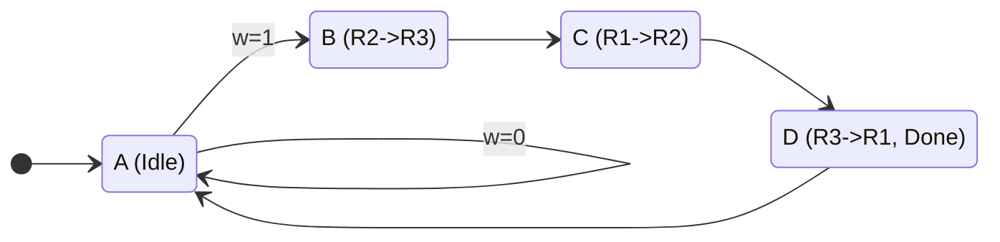

# Lecture 8: Finite State Machine Applications
{{ $slidev.configs.subject }}

010113025 Digital Circuits and Logic Design

---

## Outline

*   FSM Design Recap
*   Application 1: Sequence Detector
*   Application 2: Simple Vending Machine
*   Application 3: Security Door Lock
*   Application 4: Datapath Control Unit

---

## FSM Design Recap

A Finite State Machine (FSM) is a model of computation used to design sequential logic circuits. Its behavior can be represented by a finite number of states.

### Basic Design Steps
1.  **Specify Desired Circuit:** Clearly define inputs, outputs, and behavior.
2.  **Create State Diagram:** Visualize the states and transitions.
3.  **Create State Table:** Tabulate the state diagram's information.
4.  **Perform State Reduction (Optional):** Eliminate redundant states.
5.  **Perform State Assignment:** Assign binary codes to each state.
6.  **Choose Flip-Flop Type:** (D, JK, T) and derive logic equations.
7.  **Draw Logic Diagram:** Implement the circuit.

### Moore Machine
Outputs depend **only on the present state**.

### Mealy Machine
Outputs depend on the **present state AND current inputs**.

---

## Application 1: Sequence Detector

**Problem:** Design a Moore FSM that asserts its output `z=1` when it detects two consecutive `1`s on its input `w`.

### State Diagram
*   **State A (Reset):** No `1`s have been seen yet. Output `z=0`.
*   **State B (Got one '1'):** The last input was a `1`. Output `z=0`.
*   **State C (Got two '1's):** The last two inputs were `1`s. Output `z=1`.

This is a fundamental application used in pattern recognition, communication protocols, and command decoders.

---

## Application 2: Simple Vending Machine

**Problem:** Design a Mealy FSM for a vending machine that accepts 5¢ (Nickel) and 10¢ (Dime) coins. An item costs 15¢. The machine gives change if necessary.

### State Diagram
*   **Inputs:** `N` (Nickel), `D` (Dime).
*   **Outputs:** `Dispense` (item), `Change5` (5¢ change).
*   **States:** `S0` (0¢), `S5` (5¢), `S10` (10¢).

---

## Vending Machine: State Table

This table represents the logic from the state diagram. From here, we could assign binary values to the states (e.g., S0=00, S5=01, S10=10) and derive the logic for the flip-flops and outputs.

| Present State | Input | Next State | Output (Dispense, Change5) |
|:-------------:|:-----:|:----------:|:--------------------------:|
| S0            | N     | S5         | 0, 0                       |
| S0            | D     | S10        | 0, 0                       |
| S5            | N     | S10        | 0, 0                       |
| S5            | D     | S0         | 1, 0                       |
| S10           | N     | S0         | 1, 0                       |
| S10           | D     | S5         | 1, 1                       |

---

## Application 3: Security Door Lock

**Problem:** Design a Moore FSM for a simple digital lock. The lock opens (`Unlock=1`) if the 3-digit sequence `1-0-1` is entered on a keypad. A `Reset` button returns it to the initial locked state.

### State Diagram
*   **Input:** `Digit` (from keypad), `Reset`.
*   **Output:** `Unlock`.
*   **States:** `Locked`, `Got1`, `Got10`.

---

## Application 4: Datapath Control

As seen in `Digital_8_1.pdf`, FSMs are essential for controlling datapaths. They generate the control signals that manage data flow between registers.

**Problem:** Swap the contents of registers R1 and R2 using R3 as temporary storage. The operation starts when input `w=1`. An output `Done=1` indicates completion.

### Operations
1.  `R2 => R3` (Copy R2 to R3)
2.  `R1 => R2` (Copy R1 to R2)
3.  `R3 => R1` (Copy R3 to R1)

---

## Datapath Control: State Diagram

This Moore FSM generates the control signals (`R1in`, `R1out`, etc.) at each state to perform the register swap.

*   **State A (Idle):** No operation. All control signals are 0.
*   **State B (Step 1):** Assert `R2out` and `R3in`.
*   **State C (Step 2):** Assert `R1out` and `R2in`.
*   **State D (Step 3):** Assert `R3out`, `R1in`, and `Done`.

---

## Datapath Control: State & Output Table

The state table explicitly defines the outputs (control signals) for each state. This table is used to synthesize the combinational logic of the FSM.

| Present State | Next State (w=0) | Next State (w=1) | R1out | R1in | R2out | R2in | R3out | R3in | Done |
|:-------------:|:----------------:|:----------------:|:-----:|:----:|:-----:|:----:|:-----:|:----:|:----:|
| A             | A                | B                | 0     | 0    | 0     | 0    | 0     | 0    | 0    |
| B             | C                | C                | 0     | 0    | 1     | 0    | 0     | 1    | 0    |
| C             | D                | D                | 1     | 0    | 0     | 1    | 0     | 0    | 0    |
| D             | A                | A                | 0     | 1    | 0     | 0    | 1     | 0    | 1    |

---

## Summary

Finite State Machines are a powerful and fundamental concept for designing any system with "memory" or sequential behavior.

### Common Applications:
*   **Pattern/Sequence Recognition:** Network packet analysis, command decoders, digital locks.
*   **Counters & Timers:** Generating timing signals, controlling program flow.
*   **Control Units:** Managing complex datapaths in CPUs and other processors.
*   **Protocol Implementation:** USB, Ethernet, and other communication standards.
*   **UI Logic:** Managing states in user interfaces (e.g., elevator controls, traffic lights).

The design process is systematic, allowing complex behaviors to be broken down into manageable states and transitions.